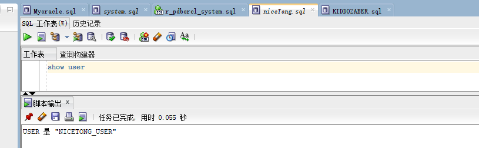
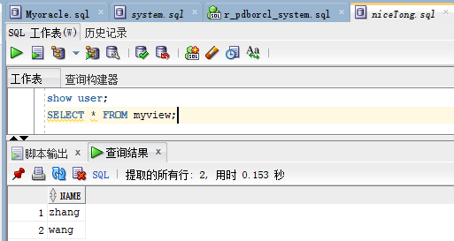
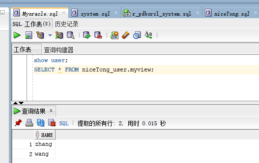
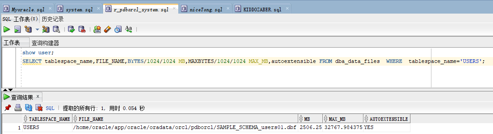
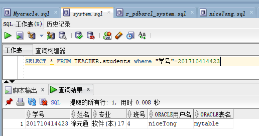

# 实验2：用户及权限管理
## 实验目的：
掌握用户管理、角色管理、权根维护与分配的能力，掌握用户之间共享对象的操作技能。

# 实验内容：
Oracle有一个开发者角色resource，可以创建表、过程、触发器等对象，但是不能创建视图。本训练要求：

## 第1步：以system登录到pdborcl，创建角色niceTong和用户niceTong_user，并授权和分配空间：

1.CREATE ROLE niceTong;   
2.GRANT connect,resource,CREATE VIEW TO niceTong;  
3.CREATE USER niceTong_user IDENTIFIED BY 123 DEFAULT TABLESPACE users TEMPORARY TABLESPACE temp;  
4. ALTER USER niceTong_user QUOTA 50M ON users;  
5. GRANT niceTong TO niceTong_user;
   
## 第2步 创建完成之后  show user

1.CREATE TABLE mytable (id number,name varchar(50));  
2.INSERT INTO mytable(id,name)VALUES(1,'zhang');  
3.INSERT INTO mytable(id,name)VALUES (2,'wang');  
4.CREATE VIEW myview AS SELECT name FROM mytable;  
### 创建表完成之后，执行查询语句 

##  第3步：用户hr连接到pdborcl，查询niceTong_user授予它的视图myview

# 数据库和表空间占用分析
SQL>SELECT tablespace_name,FILE_NAME,BYTES/1024/1024 MB,MAXBYTES/1024/1024 MAX_MB,autoextensible FROM dba_data_files  WHERE  tablespace_name='USERS';

SQL>SELECT a.tablespace_name "表空间名",Total/1024/1024 "大小MB",
 free/1024/1024 "剩余MB",( total - free )/1024/1024 "使用MB",
 Round(( total - free )/ total,4)* 100 "使用率%"
 from (SELECT tablespace_name,Sum(bytes)free
        FROM   dba_free_space group  BY tablespace_name)a,
       (SELECT tablespace_name,Sum(bytes)total FROM dba_data_files
        group  BY tablespace_name)b
 where  a.tablespace_name = b.tablespace_name;

 

# 在teacher表中查询用户

