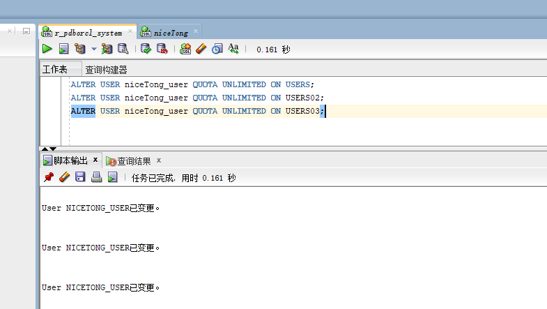
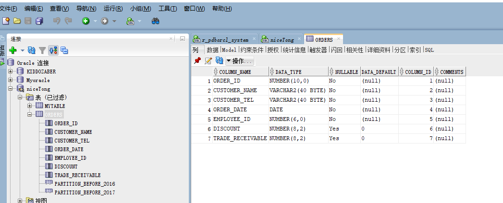
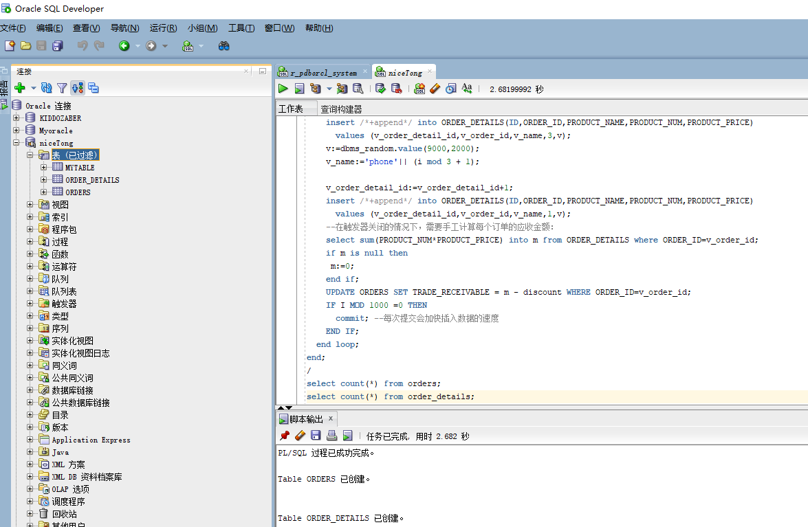
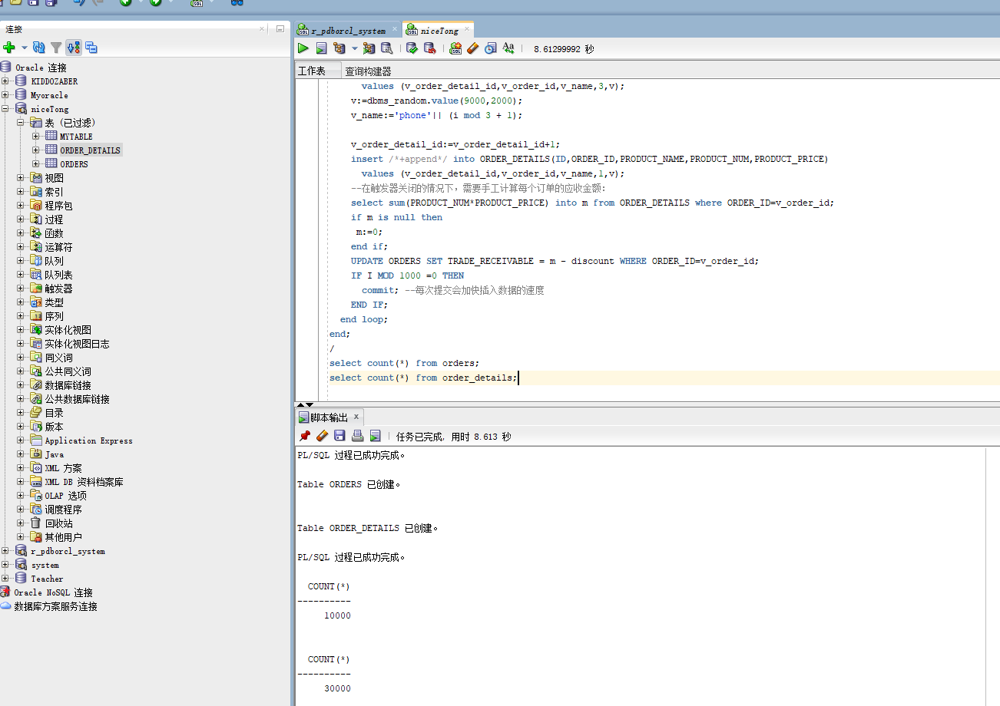
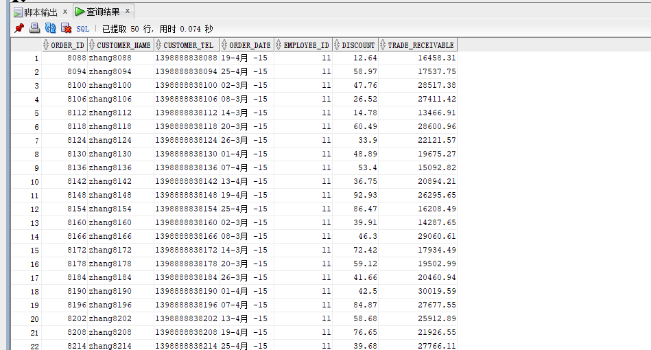
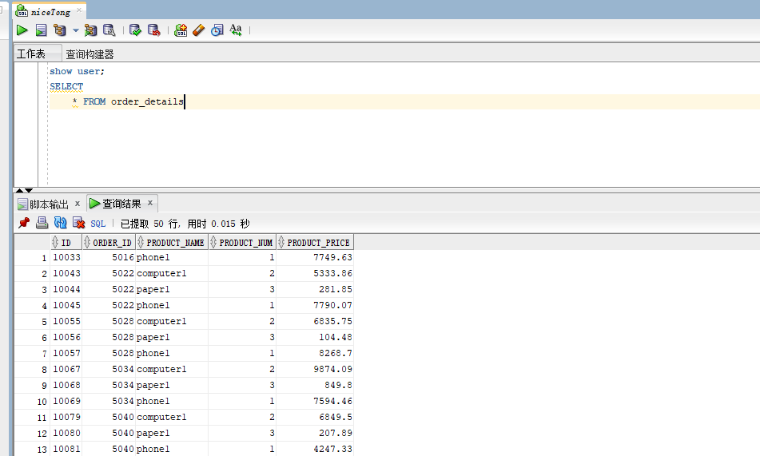
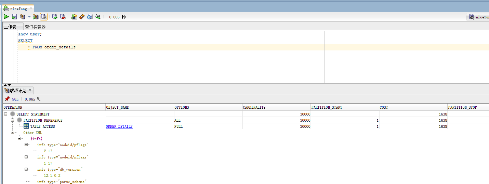

# 实验3：创建分区表
## 实验目的：
掌握分区表的创建方法，掌握各种分区方式的使用场景。

## 实验内容：
本实验使用3个表空间：USERS,USERS02,USERS03。在表空间中创建两张表：订单表(orders)与订单详表(order_details)。
使用你自己的账号创建本实验的表，表创建在上述3个分区，自定义分区策略。

你需要使用system用户给你自己的账号分配上述分区的使用权限。你需要使用system用户给你的用户分配可以查询执行计划的权限。

表创建成功后，插入数据，数据能并平均分布到各个分区。每个表的数据都应该大于1万行，对表进行联合查询。

写出插入数据的语句和查询数据的语句，并分析语句的执行计划。
进行分区与不分区的对比实验。

## 授权表空间


## 运行实验三脚本

+ # 1.创建orders表
  在主表orders和从表order_details之间建立引用分区 在study用户中创建两个表：orders（订单表）和order_details（订单详表），两个表通过列order_id建立主外键关联。orders表按范围分区进行存储，order_details使用引用分区进行存储。 创建orders表的部分语句是：
  ```
  CREATE TABLE orders 
    (
    order_id NUMBER(10, 0) NOT NULL 
    , customer_name VARCHAR2(40 BYTE) NOT NULL 
    , customer_tel VARCHAR2(40 BYTE) NOT NULL 
     , order_date DATE NOT NULL 
     , employee_id NUMBER(6, 0) NOT NULL 
     , discount NUMBER(8, 2) DEFAULT 0 
     , trade_receivable NUMBER(8, 2) DEFAULT 0 
    ) 
    TABLESPACE USERS 
    PCTFREE 10 INITRANS 1 
    STORAGE (   BUFFER_POOL DEFAULT ) 
    NOCOMPRESS NOPARALLEL 
    PARTITION BY RANGE (order_date) 
    (
    PARTITION PARTITION_BEFORE_2016 VALUES LESS THAN (
    TO_DATE(' 2016-01-01 00:00:00', 'SYYYY-MM-DD HH24:MI:SS', 
    'NLS_CALENDAR=GREGORIAN')) 
    NOLOGGING 
    TABLESPACE USERS 
    PCTFREE 10 
    INITRANS 1 
    STORAGE 
    ( 
    INITIAL 8388608 
    NEXT 1048576 
    MINEXTENTS 1 
    MAXEXTENTS UNLIMITED 
    BUFFER_POOL DEFAULT 
    ) 
    NOCOMPRESS NO INMEMORY  
    , PARTITION PARTITION_BEFORE_2017 VALUES LESS THAN (
    TO_DATE(' 2017-01-01 00:00:00', 'SYYYY-MM-DD HH24:MI:SS', 
    'NLS_CALENDAR=GREGORIAN')) 
    NOLOGGING 
    TABLESPACE USERS02 
    );
  ```


+ # 1.创建order_details表的部分语句如下：
```
       CREATE TABLE order_details 
(
id NUMBER(10, 0) NOT NULL 
, order_id NUMBER(10, 0) NOT NULL
, product_id VARCHAR2(40 BYTE) NOT NULL 
, product_num NUMBER(8, 2) NOT NULL 
, product_price NUMBER(8, 2) NOT NULL 
, CONSTRAINT order_details_fk1 FOREIGN KEY  (order_id)
REFERENCES orders  (  order_id   )
ENABLE 
) 
TABLESPACE USERS 
PCTFREE 10 INITRANS 1 
STORAGE (   BUFFER_POOL DEFAULT ) 
NOCOMPRESS NOPARALLEL
PARTITION BY REFERENCE (order_details_fk1)
(
PARTITION PARTITION_BEFORE_2016 
NOLOGGING 
TABLESPACE USERS --必须指定表空间,否则会将分区存储在用户的默认表空间中
...
) 
NOCOMPRESS NO INMEMORY, 
PARTITION PARTITION_BEFORE_2017 
NOLOGGING 
TABLESPACE USERS02
...
) 
NOCOMPRESS NO INMEMORY  
);
```


# 运行实验三脚本


# 执行查询语句





# oracle分区优缺点
分区表：

当表中的数据量不断增大，查询数据的速度就会变慢，应用程序的性能就会下降，这时就应

该考虑对表进行分区。表进行分区后，逻辑上表仍然是一张完整的表，只是将表中的数据在物理上存放到多个表空间(物理文件上)，这样查询数据时，不至于每次都扫描整张表。   

 

表分区的具体作用  

Oracle的表分区功能通过改善可管理性、性能和可用性，从而为各式应用程序带来了极大的好处。通常，分区可以使某些查询以及维护操作的性能大大提高。此外,分区还可以极大简化常见的管理任务，分区是构建千兆字节数据系统或超高可用性系统的关键工具。     

 

分区功能能够将表、索引或索引组织表进一步细分为段，这些数据库对象的段叫做分区。每个分区有自己的名称，还可以选择自己的存储特性。从数据库管理员的角度来看，一个分区后的对象具有多个段，这些段既可进行集体管理，也可单独管理，这就使数据库管理员在管理分区后的对象时有相当大的灵活性。但是，从应用程序的角度来看，分区后的表与非分区表完全相同，使用 SQL DML 命令访问分区后的表时，无需任何修改

 

什么时候使用分区表：

1、表的大小超过2GB。  

2、表中包含历史数据，新的数据被增加都新的分区中。   

必须要建表之前就创建 表分区有以下优点：   

1、改善查询性能：对分区对象的查询可以仅搜索自己关心的分区，提高检索速度。

2、增强可用性：如果表的某个分区出现故障，表在其他分区的数据仍然可用；

3、维护方便：如果表的某个分区出现故障，需要修复数据，只修复该分区即可；  

4、均衡I/O：可以把不同的分区映射到磁盘以平衡I/O，改善整个系统性能。

 缺点：   分区表相关：已经存在的表没有方法可以直接转化为分区表。不过 Oracle 提供了在线重定义表的功能。
