# 实验4：对象管理
## 实验目的：
了解Oracle表和视图的概念，学习使用SQL语句Create Table创建表，学习Select语句插入，修改，删除以及查询数据，学习使用SQL语句创建视图，学习部分存储过程和触发器的使用。
## - 实验场景：
假设有一个生产某个产品的单位，单位接受网上订单进行产品的销售。通过实验模拟这个单位的部分信息：员工表，部门表，订单表，订单详单表。
# 授权

## 下面是手工增加的一个表空间USERS02
```
    Create Tablespace niceTong
datafile
'/home/oracle/app/oracle/oradata/orcl/pdborcl/niceTong_user1.dbf'
  SIZE 100M AUTOEXTEND ON NEXT 256M MAXSIZE UNLIMITED,
'/home/oracle/app/oracle/oradata/orcl/pdborcl/niceTong_user2.dbf'
  SIZE 100M AUTOEXTEND ON NEXT 256M MAXSIZE UNLIMITED
EXTENT MANAGEMENT LOCAL SEGMENT SPACE MANAGEMENT AUTO;
```
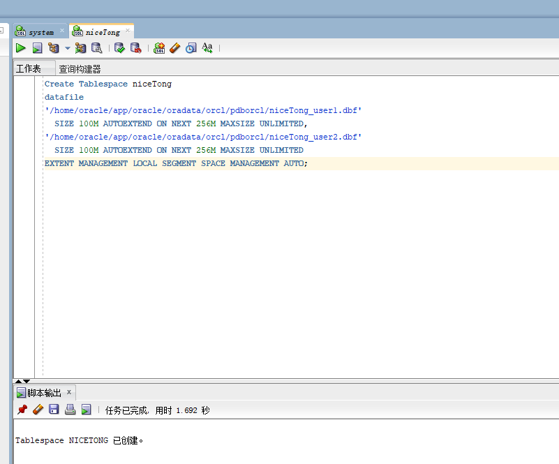
# 创建用户STUDY_niceTong 
```
 CREATE USER STUDY_niceTong IDENTIFIED BY 123
DEFAULT TABLESPACE "USERS"
TEMPORARY TABLESPACE "TEMP";
```
# 授权
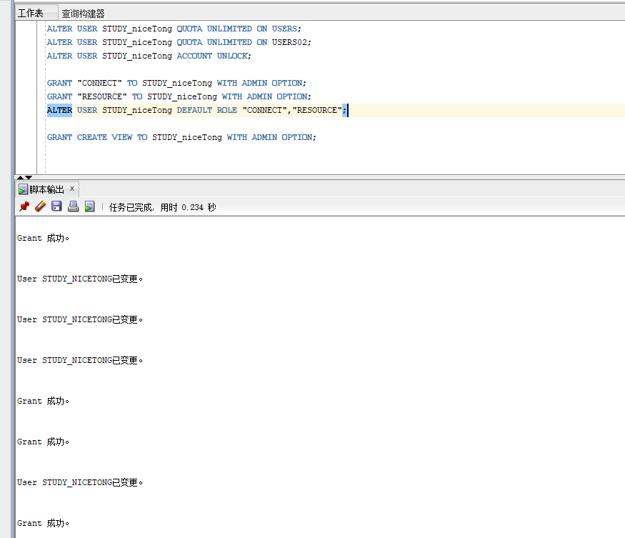

##  DDL for Table DEPARTMENTS
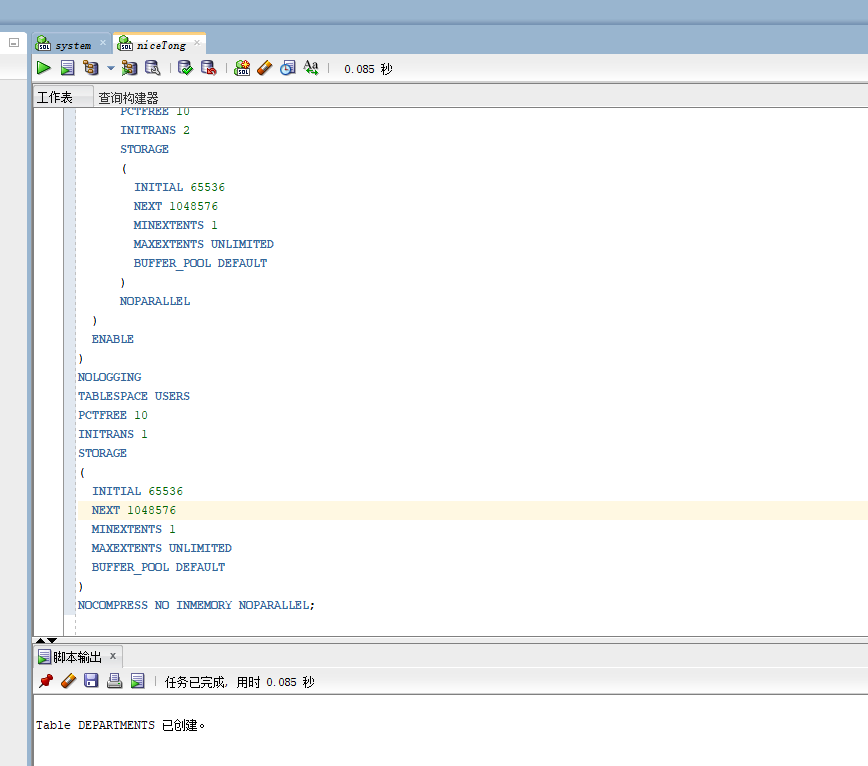

## DDL for Table EMPLOYEES
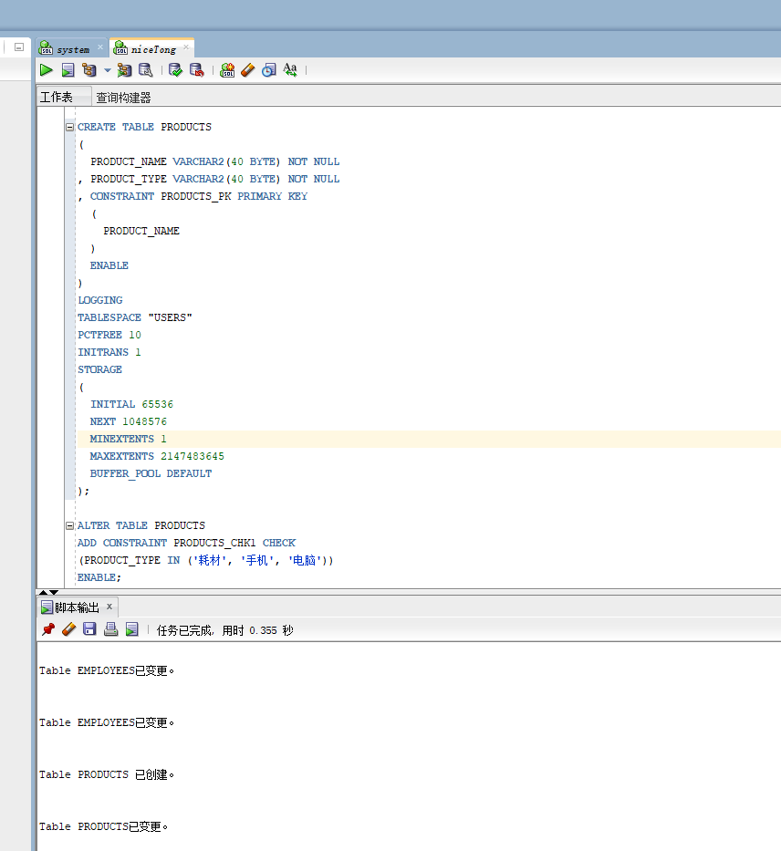

##   DDL for Table ORDER_ID_TEMP

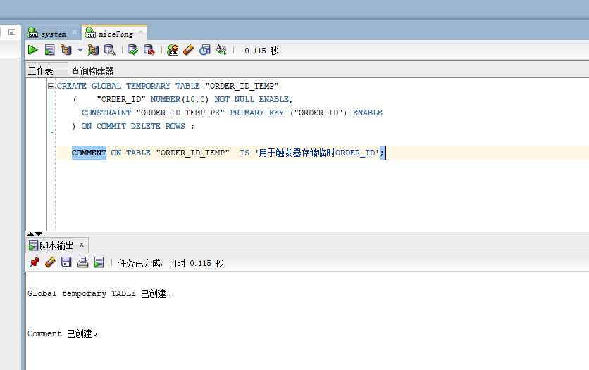
##   DDL for Table ORDERS
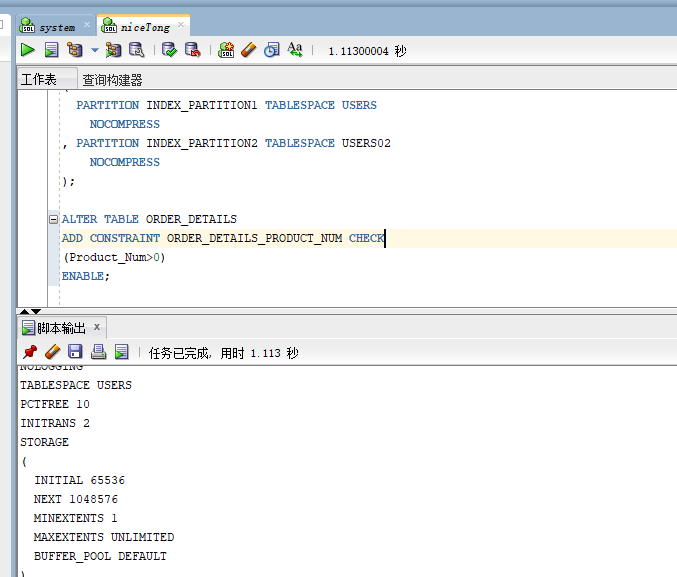
# 创建3个触发器
## DDL for Trigger ORDERS_TRIG_ROW_LEVEL
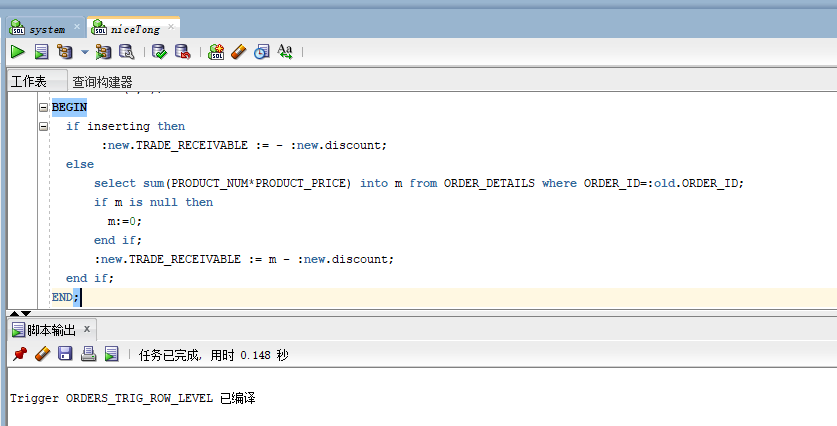
--批量插入订单数据之前，禁用触发器
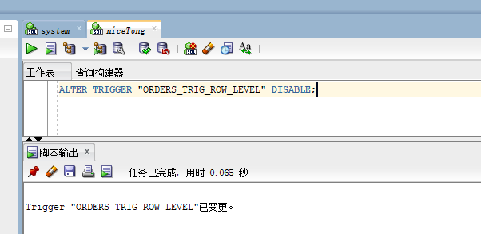
##  DDL for Trigger ORDER_DETAILS_ROW_TRIG
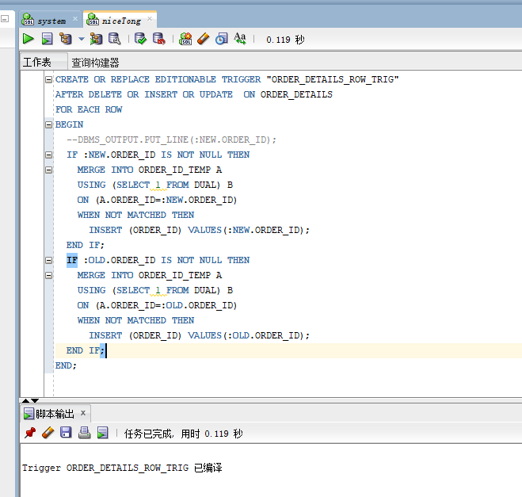
ALTER TRIGGER "ORDER_DETAILS_ROW_TRIG" DISABLE;

##  DDL for Trigger ORDER_DETAILS_SNTNS_TRIG
```
    
  CREATE OR REPLACE EDITIONABLE TRIGGER "ORDER_DETAILS_SNTNS_TRIG"
AFTER DELETE OR INSERT OR UPDATE ON ORDER_DETAILS
declare
  m number(8,2);
BEGIN
  FOR R IN (SELECT ORDER_ID FROM ORDER_ID_TEMP)
  LOOP
    --DBMS_OUTPUT.PUT_LINE(R.ORDER_ID);
    select sum(PRODUCT_NUM*PRODUCT_PRICE) into m from ORDER_DETAILS
      where ORDER_ID=R.ORDER_ID;
    if m is null then
      m:=0;
    end if;
    UPDATE ORDERS SET TRADE_RECEIVABLE = m - discount
      WHERE ORDER_ID=R.ORDER_ID;
  END LOOP;
  --delete from ORDER_ID_TEMP; --这句话很重要，否则可能一直不释放空间，后继插入会非常慢。
END;
```

## DDL for View VIEW_ORDER_DETAILS
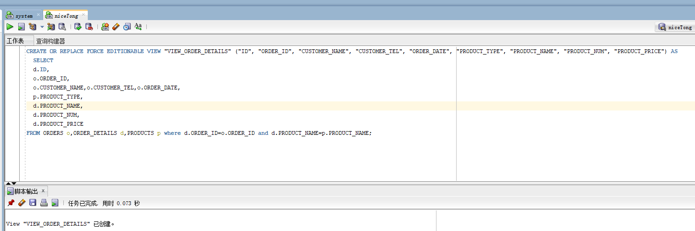
--插入DEPARTMENTS，EMPLOYEES数据
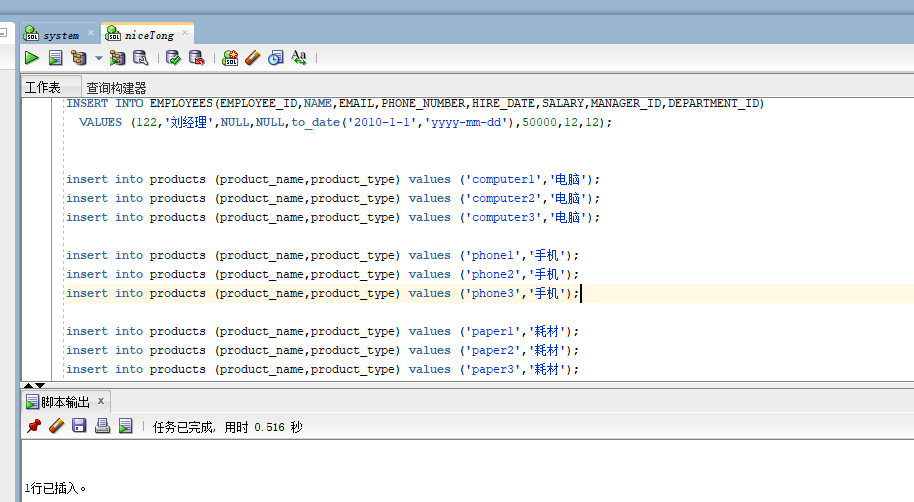
--批量插入订单数据，注意ORDERS.TRADE_RECEIVABLE（订单应收款）的自动计算,注意插入数据的速度
--2千万条记录，插入的时间是：18100秒（约5小时）

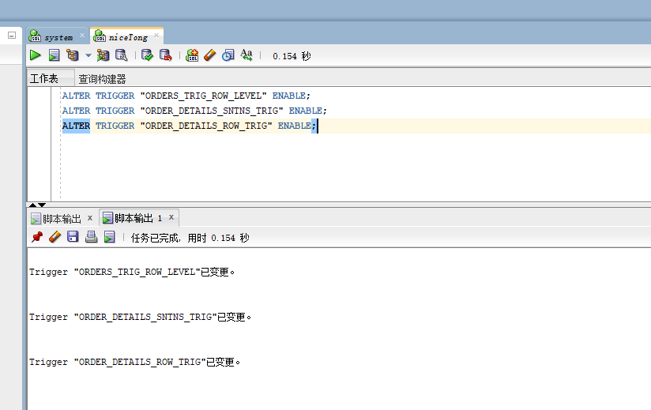
--最后动态增加一个PARTITION_BEFORE_2018分区：
```
ALTER TABLE ORDERS
ADD PARTITION PARTITION_BEFORE_2018 VALUES LESS THAN (TO_DATE(' 2018-01-01 00:00:00', 'SYYYY-MM-DD HH24:MI:SS', 'NLS_CALENDAR=GREGORIAN'));

ALTER INDEX ORDERS_INDEX_DATE
MODIFY PARTITION PARTITION_BEFORE_2018
NOCOMPRESS;
```

## 一切就绪，开始测试：
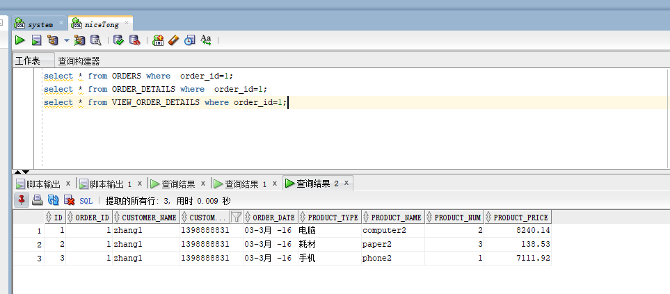

--2.递归查询某个员工及其所有下属，子下属员工。
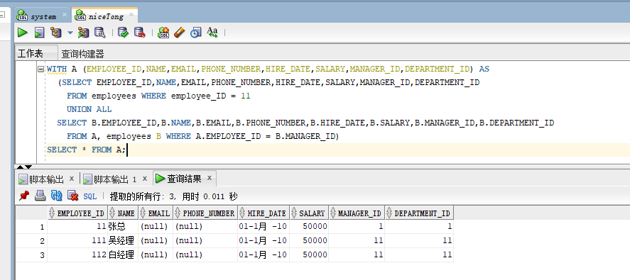
--特殊查询语句：
--查询分区表情况:

--查询一个分区中的数据

--收集表的统计信息dbms_stats.gather_table_stats
--也可以使用ANALYZE TABLE TableName COMPUTE STATISTICS; 但推荐使用dbms_stats.gather_table_stats
--分析单个表：
--exec dbms_stats.gather_table_stats(user,'ORDERS',cascade=>true); --cascade=true表示同时收集索引的信息
--exec dbms_stats.gather_table_stats(user,'ORDER_DETAILS',cascade=>true);
--统计用户的所有表：
exec dbms_stats.gather_schema_stats(User,estimate_percent=>100,cascade=> TRUE); --estimate_percent采样行的百分比
--统计完成后，查询表的统计信息：
select table_name,tablespace_name,num_rows from user_tables where table_name='ORDERS';
select table_name,tablespace_name,num_rows from user_tables where table_name='ORDER_DETAILS';


select * from orders where order_id=1300;
select * from ORDER_DETAILS where order_id=1300;
select * from orders where customer_name='zhang133000';
select * from orders where order_date<to_date('2016-01-01','yyyy-mm-dd');
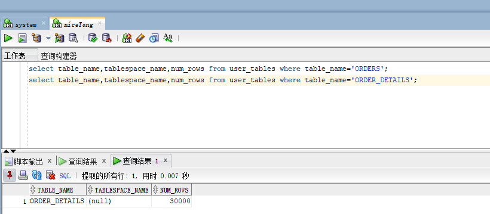


