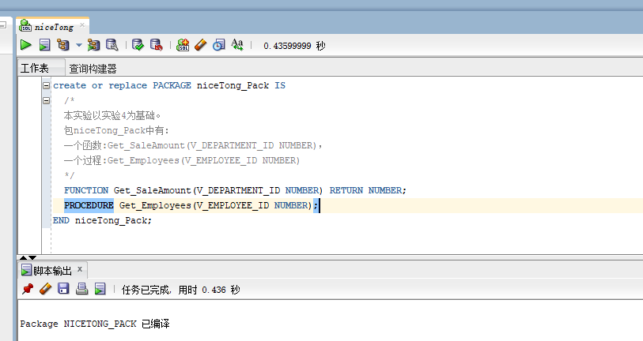
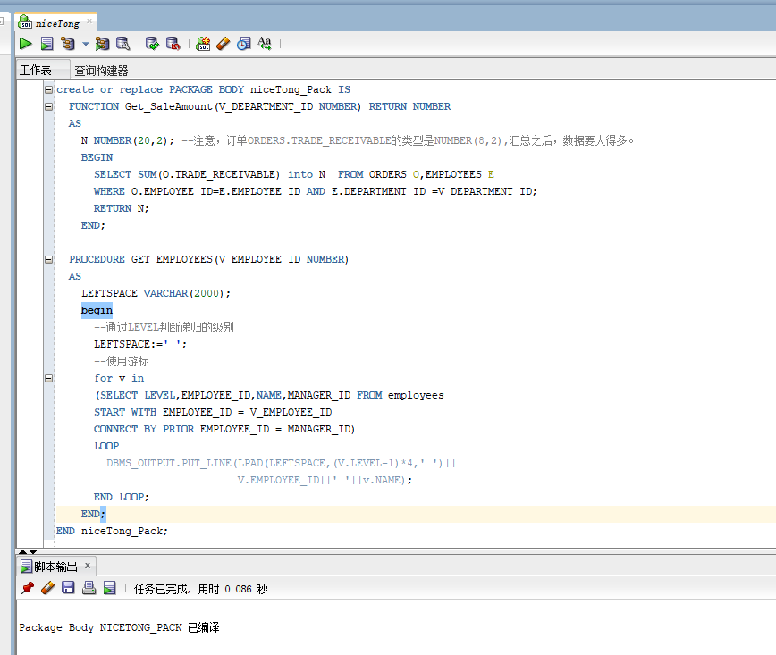
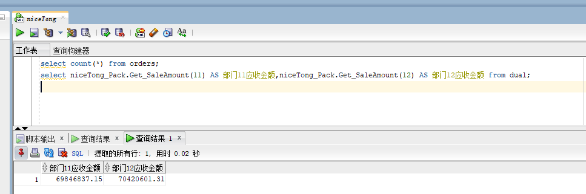
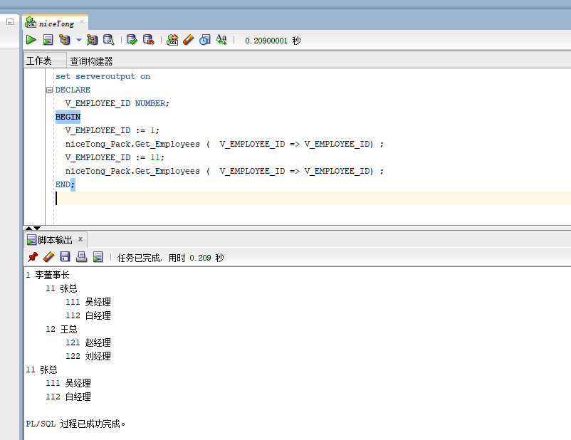

# 实验5：PL/SQL编程
## 实验目的
+ 了解PL/SQL语言结构
+ 了解PL/SQL变量和常量的声明和使用方法
+ 学习条件语句的使用方法
+ 学习分支语句的使用方法
+ 学习循环语句的使用方法
+ 学习常用的PL/SQL函数
+ 学习包，过程，函数的用法。
  
## - 实验场景：
+ 假设有一个生产某个产品的单位，单位接受网上订单进行产品的销售。通过实验模拟这个单位的部分信息：员工表，部门表，订单表，订单详单表。
+ 本实验以实验四为基础

## 实验内容：
1.创建一个包(Package)，包名是niceTong_Pack。
```
    create or replace PACKAGE niceTong_Pack IS
  /*
  本实验以实验4为基础。
  包niceTong_Pack中有：
  一个函数:Get_SaleAmount(V_DEPARTMENT_ID NUMBER)，
  一个过程:Get_Employees(V_EMPLOYEE_ID NUMBER)
  */
  FUNCTION Get_SaleAmount(V_DEPARTMENT_ID NUMBER) RETURN NUMBER;
  PROCEDURE Get_Employees(V_EMPLOYEE_ID NUMBER);
END niceTong_Pack;
```


+ 在niceTong_Pack中创建一个函数SaleAmount ，查询部门表，统计每个部门的销售总金额，每个部门的销售额是由该部门的员工(ORDERS.EMPLOYEE_ID)完成的销售额之和。函数SaleAmount要求输入的参数是部门号，输出部门的销售金额。
+ 在niceTong_Pack中创建一个过程，在过程中使用游标，递归查询某个员工及其所有下属，子下属员工。过程的输入参数是员工号，输出员工的ID,姓名，销售总金额。信息用dbms_output包中的put或者put_line函数。输出的员工信息用左添加空格的多少表示员工的层次（LEVEL）。比如下面显示5个员工的信息：
```
    create or replace PACKAGE BODY niceTong_Pack IS
  FUNCTION Get_SaleAmount(V_DEPARTMENT_ID NUMBER) RETURN NUMBER
  AS
    N NUMBER(20,2); --注意，订单ORDERS.TRADE_RECEIVABLE的类型是NUMBER(8,2),汇总之后，数据要大得多。
    BEGIN
      SELECT SUM(O.TRADE_RECEIVABLE) into N  FROM ORDERS O,EMPLOYEES E
      WHERE O.EMPLOYEE_ID=E.EMPLOYEE_ID AND E.DEPARTMENT_ID =V_DEPARTMENT_ID;
      RETURN N;
    END;

  PROCEDURE GET_EMPLOYEES(V_EMPLOYEE_ID NUMBER)
  AS
    LEFTSPACE VARCHAR(2000);
    begin
      --通过LEVEL判断递归的级别
      LEFTSPACE:=' ';
      --使用游标
      for v in
      (SELECT LEVEL,EMPLOYEE_ID,NAME,MANAGER_ID FROM employees
      START WITH EMPLOYEE_ID = V_EMPLOYEE_ID
      CONNECT BY PRIOR EMPLOYEE_ID = MANAGER_ID)
      LOOP
        DBMS_OUTPUT.PUT_LINE(LPAD(LEFTSPACE,(V.LEVEL-1)*4,' ')||
                             V.EMPLOYEE_ID||' '||v.NAME);
      END LOOP;
    END;
END niceTong_Pack;
```


# 测试
## + 函数Get_SaleAmount()测试方法：
```
select count(*) from orders;
select niceTong_Pack.Get_SaleAmount(11) AS 部门11应收金额,niceTong_Pack.Get_SaleAmount(12) AS 部门12应收金额 from dual;
```


## + 过程Get_Employees()测试代码：
```
    set serveroutput on
DECLARE
  V_EMPLOYEE_ID NUMBER;    
BEGIN
  V_EMPLOYEE_ID := 1;
  niceTong_Pack.Get_Employees (  V_EMPLOYEE_ID => V_EMPLOYEE_ID) ;  
  V_EMPLOYEE_ID := 11;
  niceTong_Pack.Get_Employees (  V_EMPLOYEE_ID => V_EMPLOYEE_ID) ;    
END;
```


+ ## 由于订单只是按日期分区的，上述统计是全表搜索，因此统计速度会比较慢，如何提高统计的速度呢？
  
```
用Where子句替换HAVING子句

　　避免使用HAVING子句, HAVING 只会在检索出所有记录之后才对结果集进行过滤。这个处理需要排序,总计等操作。 如果能通过WHERE子句限制记录的数目,那就能减少这方面的开销. (非oracle中)on、where、having这三个都可以加条件的子句中，on是最先执行，where次之，having最后，因为on是先把不符合条件的记录过滤后才进行统计，它就可以减少中间运算要处理的数据，按理说应该速度是最快的，where也应该比having快点的，因为它过滤数据后才进行sum，在两个表联接时才用on的，所以在一个表的时候，就剩下where跟having比较了。在这单表查询统计的情况下，如果要过滤的条件没有涉及到要计算字段，那它们的结果是一样的，只是where可以使用rushmore技术，而having就不能，在速度上后者要慢如果要涉及到计算的字段，就表示在没计算之前，这个字段的值是不确定的，根据上篇写的工作流程，where的作用时间是在计算之前就完成的，而having就是在计算后才起作用的，所以在这种情况下，两者的结果会不同。在多表联接查询时，on比where更早起作用。系统首先根据各个表之间的联接条件，把多个表合成一个临时表后，再由where进行过滤，然后再计算，计算完后再由having进行过滤。由此可见，要想过滤条件起到正确的作用，首先要明白这个条件应该在什么时候起作用，然后再决定放在那里
```


