
目录

<a href="#_Toc22118 ">微信小程序甜点商城 2</a>

<ol>
<li><a href="#_Toc3481 "> 甜点商城ER模型 2</a></li>
</ol>

<a href="#_Toc28190 ">1.1实体模型 2</a>

<a href="#_Toc31586 ">1.2实体联系模型 4</a>

<a href="#_Toc17290 ">整个甜点微信小程序的的ER图，如图1-10. 5</a>

<ol start="2">
<li><a href="#_Toc26089 "> 甜点商城数据表的设计 5</a></li>
<li><a href="#_Toc28214 "> 创建数据库 7</a></li>
</ol>

<a href="#_Toc10050 ">3.1配置插接式数据库PDB 7</a>

<a href="#_Toc26041 ">3.2通过Oracle SQL Developer连接数据库 8</a>

<ol start="4">
<li><a href="#_Toc3886 "> 用户创建与空间分配 8</a></li>
<li><a href="#_Toc16178 "> 创建表，约束和索引 10</a></li>
<li><a href="#_Toc22832 "> 创建触发器、序列和视图 14</a></li>
<li><a href="#_Toc16264 "> 创建程序包、函数和过程 15</a></li>
<li><a href="#_Toc6201 "> 数据库备份 20</a></li>
</ol>

<a href="#_Toc12523 ">8.1开始全备份 20</a>

<a href="#_Toc27829 ">8.2备份后修改数据 27</a>

<a href="#_Toc7465 ">8.3删除数据库文件，模拟数据库文件损坏 27</a>

<a href="#_Toc16384 ">8.4数据库完全恢复 29</a>

<a href="#_Toc23505 ">8.4.1重启损坏的数据库到mount状态 29</a>

<a href="#_Toc22671 ">8.4.2开始恢复数据库 30</a>

<a href="#_Toc6709 ">8.5查询数据是否恢复 30</a>

<a href="#_Toc29775 ">9.数据库DataGuard设计 31</a>

<a href="#_Toc29906 ">9.1oracle 12C dataguard搭建环境（主从库相同，从库只装软件不建库） 31</a>

<a href="#_Toc17157 ">9.2 dataguard主库参数配置 32</a>

<a href="#_Toc13480 ">9.3.配置两个数据库的网络参数文件tnsname.ora和listener.ora 34</a>

<a href="#_Toc10426 ">9.3.1配置tnsnames.ora参数文件 34</a>

<a href="#_Toc6270 ">9.3.2配置监听文件 35</a>

<a href="#_Toc12407 ">9.4.配置数据库参数文件 36</a>

<a href="#_Toc4398 ">9.5.启动standby database到nomount状态 37</a>

<a href="#_Toc6614 ">9.5.1检查tns连接名是否正常(主备库均需要检查) 37</a>

<a href="#_Toc20841 ">9.5.2启动备库 37</a>

<a href="#_Toc57 ">参考文献 38</a>

&nbsp;

&nbsp;

&nbsp;

&nbsp;

&nbsp;

&nbsp;

&nbsp;

&nbsp;

&nbsp;

&nbsp;

<strong><strong>微信小程序甜点商城</strong></strong>

<ol>
<li>甜点商城ER模型</li>
</ol>

本系统基于微信小程序的甜点商城系统，主要针对于大学生线上购买的小程序，服务于特定的某一个商家。如果商家在美团或则是饿了么平台上来卖东西的话，则会收取昂贵的平台费，本来大学生的消费就不是很高，再加上平台费，可能在外卖上点甜点就不是很现实。如果有了微信小程序的甜点线上商城，少了平台费，就可以在价格上面带来很大的优势。

&nbsp;

1.1实体模型&nbsp;

根据应用场景分析，共有5个原始的实体(Entity)，它们是管理员、用户、会员、订单和甜点。

管理员(admin)包括管理员id（admin_id）、联系电话（tel）、管理员名（admin_username）和管理员密码(password)，如图1-1。

&nbsp;

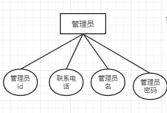图 1-1 管理员（admin）实体

&nbsp;

甜点（dessert）包括甜点id（dessert_id）、甜点图片（image）、甜点名称（name）、甜点简介（Introduction）、甜点价格（price）。管理员可对甜点进行增删查改，主要进行商品的价钱的更新。甜点的实体，如图1-2。

&nbsp;

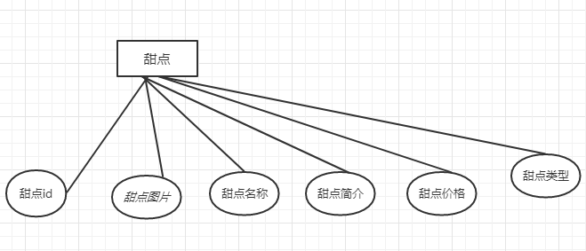图 1-2&nbsp;甜点（dessert）实体

用户（user）包括用户id（user_id）、用户名（username）、联系电话（tel）、用户地址（address）。在每次用户下单后，订单上面需要根据用户id或是用户名对该订单的详细记录写进数据库。用户实体，如图1-3。

&nbsp;

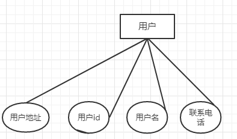图 1-3&nbsp;用户（user）实体

会员（member）包括会员id（member_id）、用户id（user_id）、会员购买时间（member_start）、会员截止时间（member_end）、购买时长（member_time）。可以根据会员的结束时间来提醒用户是否续费，根据购买时长来计算会员的截止时间。会员实体，如图1-4。

&nbsp;

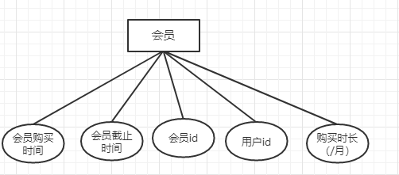图 1-4&nbsp;会员（member）实体

订单（order）包括订单编号（order_id）、用户id（user_id）、用户名（username）、用户地址（address）、下单时间（order_time）、订单总金额（total_price）。订单实体，如图1-5。

&nbsp;

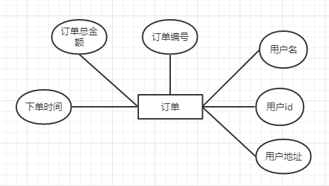图 1-5&nbsp;订单（order）实体

&nbsp;

1.2实体联系模型&nbsp;

管理员和甜点的关系是一对多的关系，在这个商城系统，只有一个管理员账号，每个员工可以登录这个管理员账号对商品的甜点信息进行增删查改。

&nbsp;

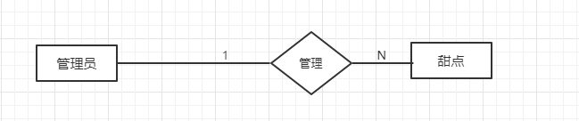图 1-6 管理员与甜点的关系简图

用户和甜点的关系是多对多，一个用户可以购买多个甜品，同一种甜品可以被多个用户购买。

&nbsp;

图 1-7 用户和甜点的关系简图

用户和会员的关系是多对一，一个用户只能购买一个会员。

&nbsp;

图 1-8 用户和会员的关系简图

用户和订单的关系是多对多，每个人的下单没有限制，一个人可以下多个订单。因为一个用户的下单地址可能不一样，所以在这里每一个订单都必须绑定自己的订单地址。

&nbsp;

图 1-9 用户和订单的关系简图

整个甜点微信小程序的的ER图，如图1-10.

&nbsp;

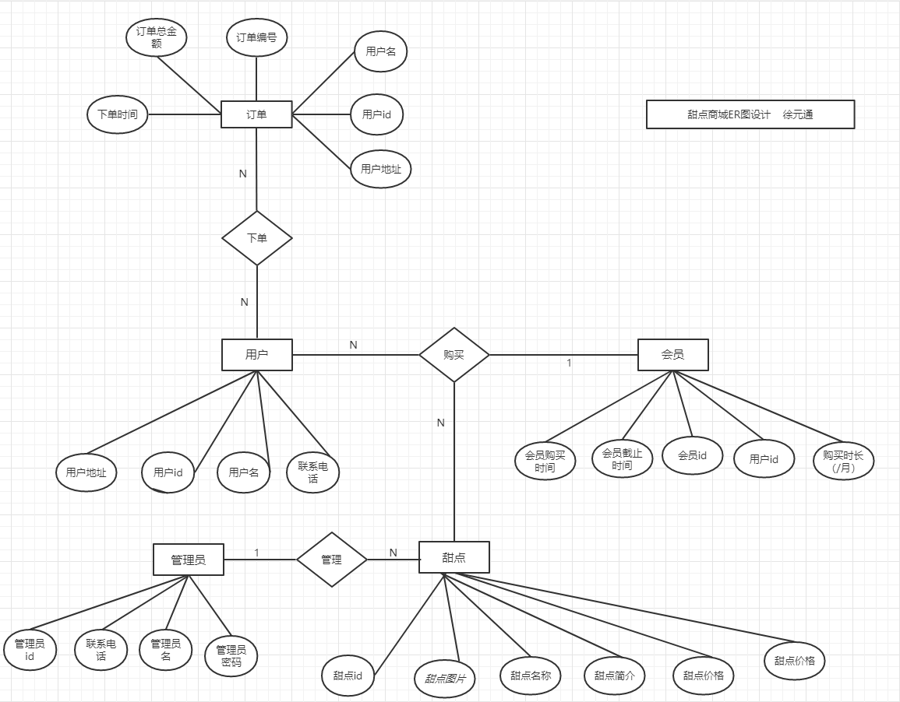图 1-10 &nbsp;甜点商城ER图

&nbsp;

<ol start="2">
<li>甜点商城数据表的设计</li>
</ol>

ER模型建立好以后，我们就可以设计Oracle的关系表了。在独立实体中找出主要属性设置为主键，比如在订单表中，订单编号（order_id）是主键。由关系派生出的实体要加入外键关系，如订单中要加入外键用户id（user_id）属性。

管理员（admin）表包括管理员id（admin_id）、联系电话(tel)、管理员名（admin_name）、管理员密码（password）,见表2-1。

表 2-1 &nbsp;甜点商城管理员ADMIN

<table>
<tbody>
<tr>
<td width="111">

<strong><strong>字段名</strong></strong>

</td>
<td width="111">

<strong><strong>数据类型</strong></strong>

</td>
<td width="111">

<strong><strong>可以为空</strong></strong>

</td>
<td width="111">

<strong><strong>注释</strong></strong>

</td>
<td width="111">

<strong><strong>备注</strong></strong>

</td>
</tr>
<tr>
<td width="111">

admin_id

</td>
<td width="111">

varchar

</td>
<td width="111">

no

</td>
<td width="111">

管理员ID

</td>
<td width="111">

主键

</td>
</tr>
<tr>
<td width="111">

tel

</td>
<td width="111">

varchar

</td>
<td width="111">

no

</td>
<td width="111">

管理员联系方式

</td>
<td width="111">

&nbsp;

</td>
</tr>
<tr>
<td width="111">

admin_name

</td>
<td width="111">

varchar

</td>
<td width="111">

no

</td>
<td width="111">

管理员名

</td>
<td width="111">

&nbsp;

</td>
</tr>
<tr>
<td width="111">

password

</td>
<td width="111">

varchar

</td>
<td width="111">

no

</td>
<td width="111">

管理员密码

</td>
<td width="111">

&nbsp;

</td>
</tr>
</tbody>
</table>

&nbsp;

&nbsp;

&nbsp;

&nbsp;

&nbsp;

&nbsp;

用户表USERS包括用户ID（user_id）、用户的联系方式（tel）、用户名（username）、用户的联系地址（address），其中用户的联系地址可以有多个地址，用逗号（，）隔开，见表2-2。

表 2-2 &nbsp;甜点商城用户USERNAME

<table>
<tbody>
<tr>
<td width="111">

<strong><strong>字段名</strong></strong>

</td>
<td width="111">

<strong><strong>数据类型</strong></strong>

</td>
<td width="111">

<strong><strong>可以为空</strong></strong>

</td>
<td width="111">

<strong><strong>注释</strong></strong>

</td>
<td width="111">

<strong><strong>备注</strong></strong>

</td>
</tr>
<tr>
<td width="111">

user_id

</td>
<td width="111">

varchar

</td>
<td width="111">

no

</td>
<td width="111">

用户ID

</td>
<td width="111">

主键

</td>
</tr>
<tr>
<td width="111">

tel

</td>
<td width="111">

varchar

</td>
<td width="111">

no

</td>
<td width="111">

用户联系方式

</td>
<td width="111">

&nbsp;

</td>
</tr>
<tr>
<td width="111">

username

</td>
<td width="111">

varchar

</td>
<td width="111">

no

</td>
<td width="111">

用户名

</td>
<td width="111">

&nbsp;

</td>
</tr>
<tr>
<td width="111">

address

</td>
<td width="111">

varchar

</td>
<td width="111">

yes

</td>
<td width="111">

用户地址

</td>
<td width="111">

可以有多个地址

</td>
</tr>
</tbody>
</table>

&nbsp;

甜点表DESERT包括甜点ID（desert_id）、甜点图片（desert_image）、甜点名称（desert_name）、甜点简介（introduce）、甜点价格（price），见表2-3。

表 2-3 甜点商城甜点DESERT

<table>
<tbody>
<tr>
<td width="111">

<strong><strong>字段名</strong></strong>

</td>
<td width="111">

<strong><strong>数据类型</strong></strong>

</td>
<td width="111">

<strong><strong>可以为空</strong></strong>

</td>
<td width="111">

<strong><strong>注释</strong></strong>

</td>
<td width="111">

<strong><strong>备注</strong></strong>

</td>
</tr>
<tr>
<td width="111">

desert_id

</td>
<td width="111">

varchar

</td>
<td width="111">

no

</td>
<td width="111">

甜点ID

</td>
<td width="111">

主键

</td>
</tr>
<tr>
<td width="111">

desert_image

</td>
<td width="111">

varchar

</td>
<td width="111">

no

</td>
<td width="111">

甜点图片

</td>
<td width="111">

&nbsp;

</td>
</tr>
<tr>
<td width="111">

desert_name

</td>
<td width="111">

varchar

</td>
<td width="111">

no

</td>
<td width="111">

甜点名称

</td>
<td width="111">

&nbsp;

</td>
</tr>
<tr>
<td width="111">

introduce

</td>
<td width="111">

varchar

</td>
<td width="111">

yes

</td>
<td width="111">

甜点简介

</td>
<td width="111">

可以为空

</td>
</tr>
<tr>
<td width="111">

price

</td>
<td width="111">

float

</td>
<td width="111">

no

</td>
<td width="111">

甜点价格

</td>
<td width="111">

&nbsp;

</td>
</tr>
<tr>
<td width="111">

type

</td>
<td width="111">

varchar

</td>
<td width="111">

no

</td>
<td width="111">

甜点的类型

</td>
<td width="111">

种类

</td>
</tr>
</tbody>
</table>

&nbsp;

&nbsp;

&nbsp;

会员表MEMBER包括会员ID（member_id）、会员购买时间（member_start）、会员截止时间（member_end）、购买时长（member_time）、用户ID（user_id），见表1-4。

&nbsp;

表 2-4 甜点商城会员MEMBER

<table>
<tbody>
<tr>
<td width="111">

<strong><strong>字段名</strong></strong>

</td>
<td width="111">

<strong><strong>数据类型</strong></strong>

</td>
<td width="111">

<strong><strong>可以为空</strong></strong>

</td>
<td width="111">

<strong><strong>注释</strong></strong>

</td>
<td width="111">

<strong><strong>备注</strong></strong>

</td>
</tr>
<tr>
<td width="111">

member_id

</td>
<td width="111">

varchar

</td>
<td width="111">

no

</td>
<td width="111">

会员ID

</td>
<td width="111">

主键

</td>
</tr>
<tr>
<td width="111">

member_start

</td>
<td width="111">

date

</td>
<td width="111">

no

</td>
<td width="111">

会员开始时间

</td>
<td width="111">

&nbsp;

</td>
</tr>
<tr>
<td width="111">

member_end

</td>
<td width="111">

date

</td>
<td width="111">

no

</td>
<td width="111">

会员结束时间

</td>
<td width="111">

&nbsp;

</td>
</tr>
<tr>
<td width="111">

member_time

</td>
<td width="111">

varchar

</td>
<td width="111">

no

</td>
<td width="111">

会员总时间

</td>
<td width="111">

&nbsp;

</td>
</tr>
<tr>
<td width="111">

user_id

</td>
<td width="111">

varchar

</td>
<td width="111">

no

</td>
<td width="111">

用户id

</td>
<td width="111">

外键

</td>
</tr>
</tbody>
</table>

&nbsp;

订单（order）包括订单编号（order_id）、用户id（user_id）、用户名（username）、用户地址（address）、下单时间（order_time）、订单总金额（total_price）。订单实体，如表2-5。

&nbsp;

&nbsp;

&nbsp;

&nbsp;

表 2-5 甜点商城订单ORDER

<table>
<tbody>
<tr>
<td width="111">

<strong><strong>字段名</strong></strong>

</td>
<td width="111">

<strong><strong>数据类型</strong></strong>

</td>
<td width="111">

<strong><strong>可以为空</strong></strong>

</td>
<td width="111">

<strong><strong>注释</strong></strong>

</td>
<td width="111">

<strong><strong>备注</strong></strong>

</td>
</tr>
<tr>
<td width="111">

order_id

</td>
<td width="111">

varchar

</td>
<td width="111">

no

</td>
<td width="111">

订单ID

</td>
<td width="111">

主键

</td>
</tr>
<tr>
<td width="111">

user_id

</td>
<td width="111">

varchar

</td>
<td width="111">

no

</td>
<td width="111">

用户ID

</td>
<td width="111">

外键

</td>
</tr>
<tr>
<td width="111">

username

</td>
<td width="111">

varchar

</td>
<td width="111">

no

</td>
<td width="111">

用户名

</td>
<td width="111">

&nbsp;

</td>
</tr>
<tr>
<td width="111">

address

</td>
<td width="111">

varchar

</td>
<td width="111">

no

</td>
<td width="111">

订单地址

</td>
<td width="111">

&nbsp;

</td>
</tr>
<tr>
<td width="111">

order_time

</td>
<td width="111">

date

</td>
<td width="111">

no

</td>
<td width="111">

下单时间

</td>
<td width="111">

&nbsp;

</td>
</tr>
<tr>
<td width="111">

total_price

</td>
<td width="111">

float

</td>
<td width="111">

no

</td>
<td width="111">

订单总金额

</td>
<td width="111">

&nbsp;

</td>
</tr>
</tbody>
</table>

&nbsp;

<ol start="3">
<li>创建数据库</li>
</ol>

3.1配置插接式数据库PDB

配置插接式数据库PDB可以通过SQL语句创建插接式数据库，在创建时可以选择创建一个新的空的PDB，不包含任何数据；也可以选择一个现有的PDB克隆成另一个PDB，所谓克隆，是指将原有的PDB的用户信息和数据信息一起复制到新的PDB中，这也是Oracle 12C的重要特性。

在这儿，我们通过dbca工具创建插接式数据库，首先以Oracle用户登录，运行dbca命令，然后根据提示操作，要注意输入正确的数据库目录、PDB数据库名称以管理员信息。

&nbsp;

&nbsp;

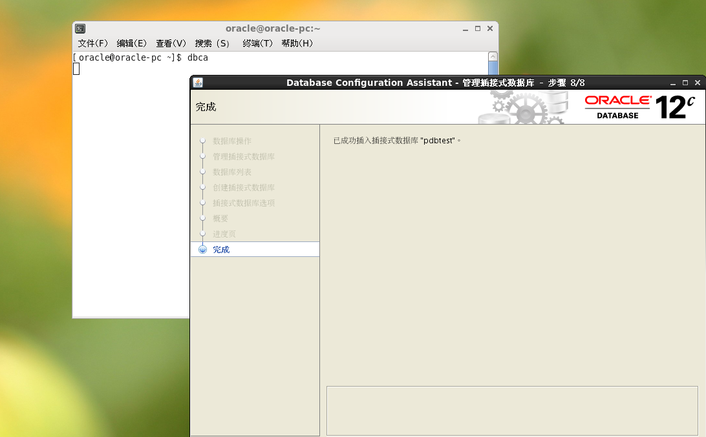图 3-1&nbsp;甜点商城通过dbca创建插接式数据库

&nbsp;

&nbsp;

&nbsp;

&nbsp;

3.2通过Oracle SQL Developer连接数据库

Oracle SQL Developer是一个免费的GUI图形界面的管理和开发工具，可以提高工作效率并简化数据库开发任务。SQL Developer可以在没有安装数据库的客户端上运行，支持Windows、Linux、Mac系统。

可以在Oracle官网上下载，直接使用，无需安装。Oracle SQL Developer是基于Java的应用程序，如果客户端没有安装Java，就需要下载自带有Java的SQL Developer，如果客户端已经安装了Java，就可以下载不带Java版本。

&nbsp;

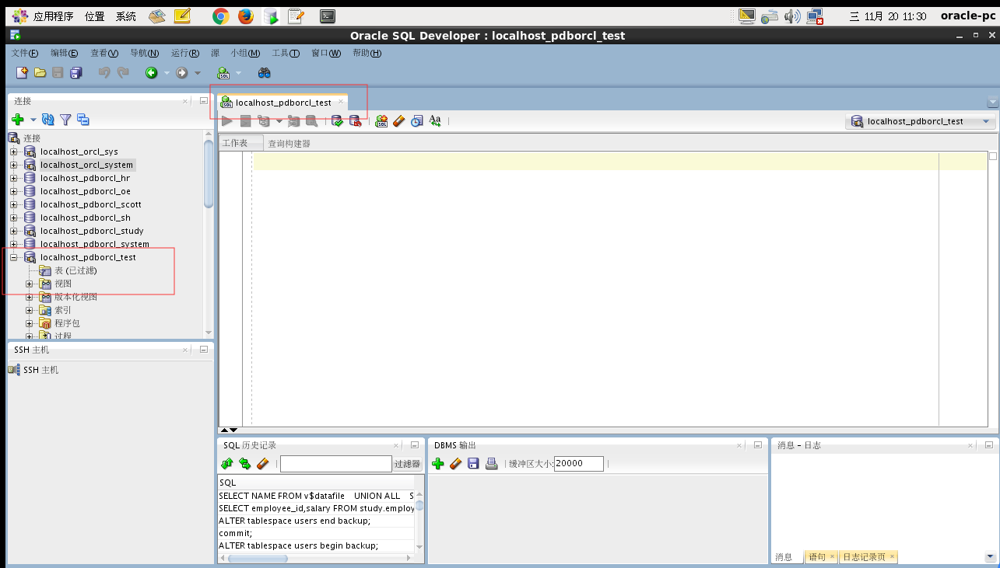图 3-2&nbsp;甜点商城通过SQL Developer连接Oracle

&nbsp;

&nbsp;

<ol start="4">
<li>用户创建与空间分配</li>
</ol>

表的结构设计之后，还需要考虑用户和空间的分配问题。我们需要为系统新建一个用户（NICETONG）。另外还需要为甜点商城系统创建一个新表空间NICETONG用户存储订单记录。

下面是SYSTEM用户创建的一个表空间nicetong的命令，注意给nicetong表空间分配了两个数据文件：pdbtest_nicetong1.dbf和pdbtest_nicetong2.dbf，这两个数据文件初始大小都是100M，所以表空间的初始大小是200M。

<table>
<tbody>
<tr>
<td width="568">

create tablespace nicetong

datafile

'/home/oracle/app/oracle/oradata/orcl/pdborcl/pdbtest_nicetong1.dbf'

size 100M AUTOEXTEND ON NEXT 256M MAXSIZE UNLIMITED,

'/home/oracle/app/oracle/oradata/orcl/pdborcl/pdbtest_nicetong2.dbf'

size 100M AUTOEXTEND ON NEXT 256M MAXSIZE UNLIMITED

EXTENT MANAGEMENT LOCAL SEGMENT SPACE MANAGEMENT AUTO;

</td>
</tr>
</tbody>
</table>

&nbsp;

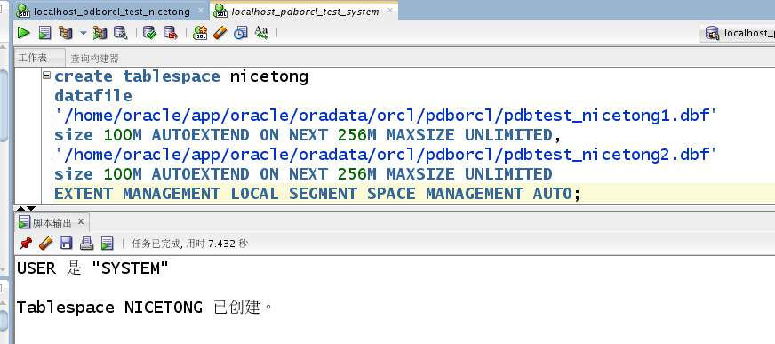图 4-1&nbsp;甜点商城创建表空间nicetong

表空间nicetong创建完成之后，就可以创建用户了。我们可以为本系统设计的用户名称是nicetong。用户创建之后，给用户nicetong分配表空间nicetong的使用配额，再分配角色CONNECT和RESOURCE，以便该用户可以连接数据库，可以创建资源（表，过程，序列等资源对象），最后再分配一个系统权限：&rdquo;CREATE VIEW&rdquo;，以便该用户可以创建视图。

<table>
<tbody>
<tr>
<td width="568">

//给用户nicetong

alter &nbsp;user nicetong &nbsp;DEFAULT TABLESPACE "USERS" TEMPORARY TABLESPACE "TEMP";

-- QUOTAS

ALTER USER nicetong QUOTA UNLIMITED ON USERS;

ALTER USER nicetong QUOTA UNLIMITED ON nicetong;

-- ROLES

GRANT "CONNECT" TO nicetong WITH ADMIN OPTION;

GRANT "RESOURCE" TO nicetong WITH ADMIN OPTION;

ALTER USER nicetong DEFAULT ROLE "CONNECT","RESOURCE";

-- SYSTEM PRIVILEGES

GRANT CREATE VIEW TO nicetong WITH ADMIN OPTION;

</td>
</tr>
</tbody>
</table>

&nbsp;

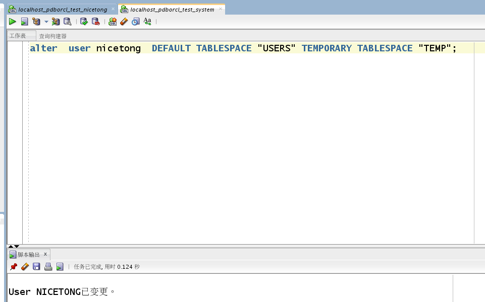图 4-2&nbsp;甜点商城创建用户以及分配表空间

&nbsp;

&nbsp;

到现在，我们有了两个表空间USERS（原有的）和NICETONG（新建的）。这里我们假定店主的销售订单非常多，订单表的记录非常大，可能上千万条记录，所以我们把ORDERS表设计为基于REDER_DATA的分区表，以加快局部时间范围的查询速度。存储空间的分如表4-1。

&nbsp;

表 4-1&nbsp;甜点商城存储空间分配

<table>
<tbody>
<tr>
<td width="106">

<strong><strong>表</strong></strong>

</td>
<td width="216">

<strong><strong>表空间USERS</strong></strong>

</td>
<td width="213">

<strong><strong>表空间NICETONG</strong></strong>

</td>
</tr>
<tr>
<td width="106">

ORDERS

</td>
<td width="216">

存储全部数据

</td>
<td width="213">

&nbsp;

</td>
</tr>
<tr>
<td width="106">

USERS

</td>
<td width="216">

存储全部数据

</td>
<td width="213">

&nbsp;

</td>
</tr>
<tr>
<td width="106">

ADMIN

</td>
<td width="216">

存储全部数据

</td>
<td width="213">

&nbsp;

</td>
</tr>
<tr>
<td width="106">

MEMBER

</td>
<td width="216">

存储2019年前（不含）的数据

</td>
<td width="213">

存储2019年前（不含）的数据

</td>
</tr>
<tr>
<td width="106">

DESERT

</td>
<td width="216">

存储全部数据

</td>
<td width="213">

&nbsp;

</td>
</tr>
</tbody>
</table>

&nbsp;

<ol start="5">
<li>创建表，约束和索引</li>
</ol>

用户和空间分配完成后，可以创建表，约束和索引了。创建表的命令是 CREATE TABLE，由于命令参数和选项很复杂，命令行数非常多，所以这里就不将创建表的 DDL语句全部写出来。这里仅对 ORDERS 和 DESERT两个表的创建作一些说明，ORDERS 表按分区存储，分区类型选择&ldquo;RANG&rdquo;范围分区，创建 ORDERS 表的部分语句是：

<table>
<tbody>
<tr>
<td width="568">

create table ORDERS

(

order_id &nbsp;VARCHAR2(10) PRIMARY KEY NOT NULL,

user_id VARCHAR2(10) NOT NULL,

username VARCHAR2(9) NOT NULL,

address &nbsp;VARCHAR2(10) NOT NULL,

order_time DATE NOT NULL,

total_price FLOAT NOT NULL

);

CREATE TABLE DESERT(

desert_id VARCHAR2(10) PRIMARY KEY NOT NULL,

desert_image VARCHAR2(14) NOT NULL,

desert_name VARCHAR2(13) NOT NULL,

introduce VARCHAR2(14) NOT NULL,

price FLOAT NOT NULL,

type VARCHAR2(14) NOT NULL

);

CREATE TABLE MEMBER

(

member_id VARCHAR2(10) PRIMARY KEY NOT NULL,

member_start &nbsp;DATE NOT NULL,

member_end DATE NOT NULL ,

member_time VARCHAR2(10) NOT NULL,

user_id VARCHAR2(10) NOT NULL

);

CREATE TABLE USERS

(

user_id VARCHAR2(10) PRIMARY KEY NOT NULL,

tel VARCHAR2(10) NOT NULL,

username VARCHAR2(10) NOT NULL,

address VARCHAR2(10)

);

CREATE TABLE ADMIN

(

admin_id VARCHAR2(10) PRIMARY KEY NOT NULL,

tel VARCHAR2(10) NOT NULL,

admin_name VARCHAR2(10) NOT NULL,

password VARCHAR2(10) NOT NULL

);

</td>
</tr>
</tbody>
</table>

&nbsp;

&nbsp;

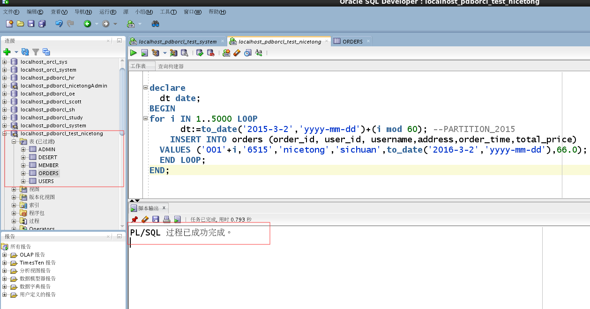图 5-1&nbsp;甜点商城创建表及其约束

&nbsp;

在这个命令中，核心的语句是&ldquo;PARTITION BY RANGE (order_time)&rdquo;，表示按订单时间 ORDER_TIME&nbsp;的范围进行分区。分区 PARTITION_BEFORE_2019存储订单时间小于2019年 的订单记录，这个分区存储在表空间 USERS 中 ,而分区PARTITION_BEFORE_2020&nbsp;存储的是订单时间小于 2020&nbsp;年的订单记录，由于有分区PARTITION_BEFORE_2019&nbsp;的存在，PARTITION_BEFORE_2020&nbsp;分区实际只存储 2019年一年的记录。创建 ORDERS表的部分语句如下：

<table>
<tbody>
<tr>
<td width="568">

create table ORDERS

(

order_id &nbsp;VARCHAR2(10) PRIMARY KEY NOT NULL,

user_id VARCHAR2(10) NOT NULL,

username VARCHAR2(9) NOT NULL,

address &nbsp;VARCHAR2(10) NOT NULL,

order_time DATE NOT NULL,

total_price FLOAT NOT NULL

)

TABLESPACE USERS

PCTFREE 10 INITRANS 1

STORAGE ( &nbsp;&nbsp;BUFFER_POOL DEFAULT )

NOCOMPRESS NOPARALLEL

PARTITION BY RANGE (order_time)

(

&nbsp;PARTITION PARTITION_BEFORE_2016 VALUES LESS THAN (

&nbsp;TO_DATE(' 2019-01-01 00:00:00', 'SYYYY-MM-DD HH24:MI:SS',

&nbsp;'NLS_CALENDAR=GREGORIAN'))

&nbsp;NOLOGGING

&nbsp;TABLESPACE USERS

&nbsp;PCTFREE 10

&nbsp;INITRANS 1

&nbsp;STORAGE

(

&nbsp;INITIAL 8388608

&nbsp;NEXT 1048576

&nbsp;MINEXTENTS 1

&nbsp;MAXEXTENTS UNLIMITED

&nbsp;BUFFER_POOL DEFAULT

)

NOCOMPRESS NO INMEMORY &nbsp;

, PARTITION PARTITION_BEFORE_2017 VALUES LESS THAN (

TO_DATE(' 2020-01-01 00:00:00', 'SYYYY-MM-DD HH24:MI:SS',

'NLS_CALENDAR=GREGORIAN'))

NOLOGGING

);

</td>
</tr>
</tbody>
</table>

&nbsp;

向订单表中加入50000条数据

<table>
<tbody>
<tr>
<td width="568">

declare

&nbsp;&nbsp;dt date;

BEGIN

for i IN 1..50000 LOOP

&nbsp;&nbsp;&nbsp;&nbsp;&nbsp;&nbsp;dt:=to_date('2015-3-2','yyyy-mm-dd')+(i mod 60); --PARTITION_2015

&nbsp;&nbsp;&nbsp;&nbsp;INSERT INTO orders (order_id, user_id, username,address,order_time,total_price)

&nbsp;&nbsp;VALUES ('001'+i,'6515','nicetong','sichuan',to_date('2016-3-2','yyyy-mm-dd'),66.0);

&nbsp;&nbsp;END LOOP;

END;

</td>
</tr>
</tbody>
</table>

&nbsp;

&nbsp;

查询插入的数据

<table>
<tbody>
<tr>
<td width="568">

select * from orders;

select count(order_id) from orders;

</td>
</tr>
</tbody>
</table>

&nbsp;

&nbsp;

&nbsp;

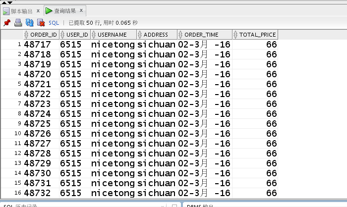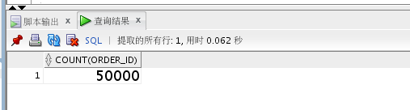图 5-2 向order表中插入50000条数据

因为订单表的数据很多，我们在这里可以为订单表建立索引。

为user_id建立索引

<table>
<tbody>
<tr>
<td width="568">

create index info_order_id on orders (user_id);

</td>
</tr>
</tbody>
</table>

&nbsp;

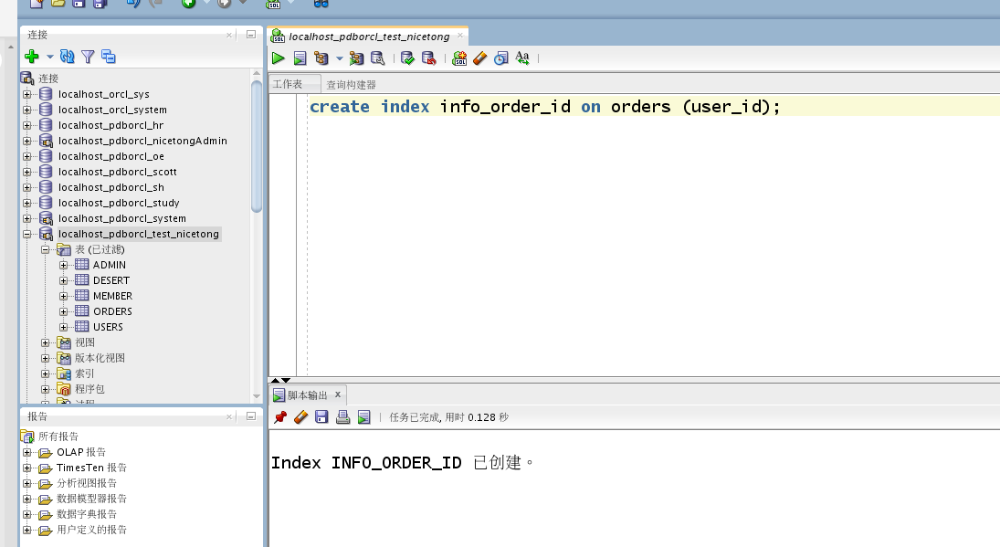图 5-3&nbsp;甜点商城创建索引

&nbsp;

&nbsp;

&nbsp;

<ol start="6">
<li>创建触发器、序列和视图</li>
</ol>

&nbsp;

主要用于级联更新，如更新users表中的users_id时，member表的user_id也更新。

<table>
<tbody>
<tr>
<td width="568">

CREATE OR REPLACE TRIGGER cascade_trigger

AFTER UPDATE OF user_id ON users

FOR EACH ROW

BEGIN

&nbsp;&nbsp;UPDATE member SET user_id=:new.user_id WHERE user_id=:old.user_id;

END;

</td>
</tr>
</tbody>
</table>

&nbsp;

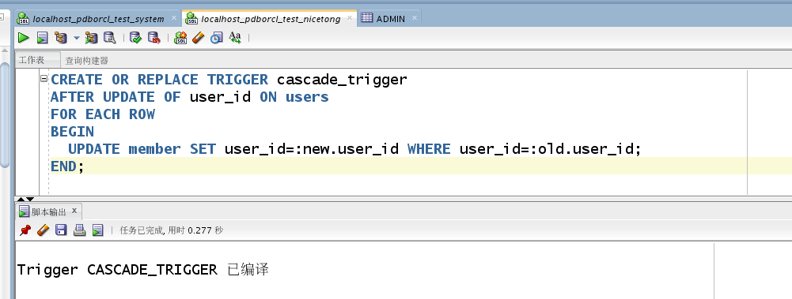图 6-1&nbsp;甜点商城创建级联更新用户id的触发器

创建序列：为orders表创建自增序列。

<table>
<tbody>
<tr>
<td width="568">

CREATE SEQUENCE orders_sequence

INCREMENT BY 1 &nbsp;&nbsp;

START WITH 1 &nbsp;&nbsp;&nbsp;&nbsp;

NOMAXVALUE &nbsp;&nbsp;&nbsp;&nbsp;&nbsp;&nbsp;

NOCYCLE &nbsp;&nbsp;&nbsp;&nbsp;&nbsp;&nbsp;&nbsp;&nbsp;&nbsp;

CACHE 10;

</td>
</tr>
</tbody>
</table>

&nbsp;

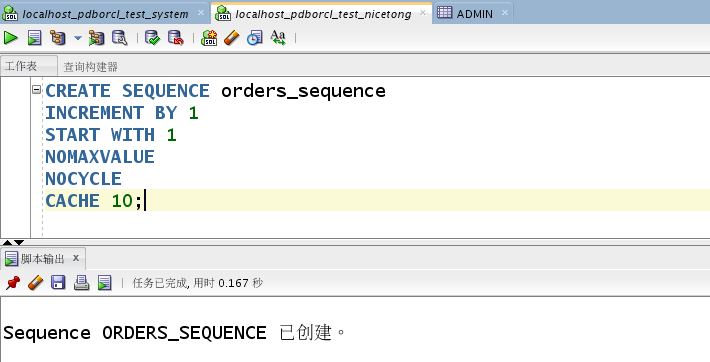图 6-2 甜点商城创建序列

&nbsp;

<ol start="7">
<li>创建程序包、函数和过程</li>
</ol>

7.1创建一个存储过程，修改admin表中的admin_name字段。

<table>
<tbody>
<tr>
<td width="568">

create or replace procedure update_admin

(

v_admin_id &nbsp;varchar2,

v_admin_name &nbsp;varchar2

) is

begin

update admin set admin_name=v_admin_name where admin_id=v_admin_id; &nbsp;

end update_admin;

</td>
</tr>
</tbody>
</table>

&nbsp;

&nbsp;

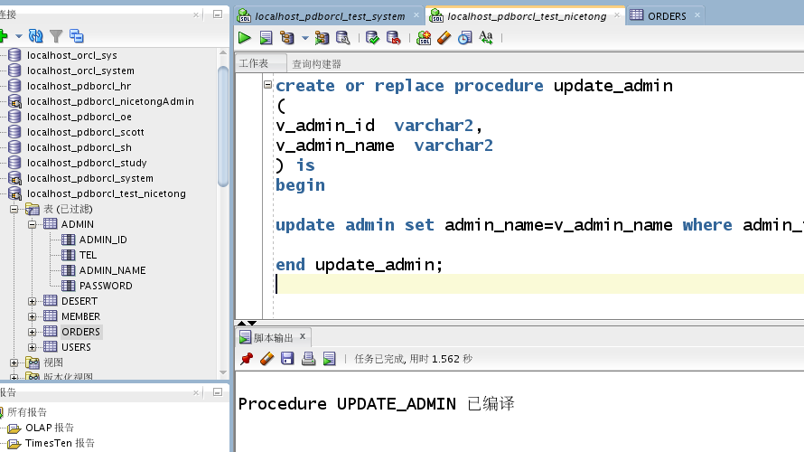图 7-1&nbsp;甜点商城创建更新管理员密码的存储过程

测试存储过程：

<table>
<tbody>
<tr>
<td width="568">

select * from admin;

exec &nbsp;update_admin('001','test');

select * from admin;

</td>
</tr>
</tbody>
</table>

&nbsp;

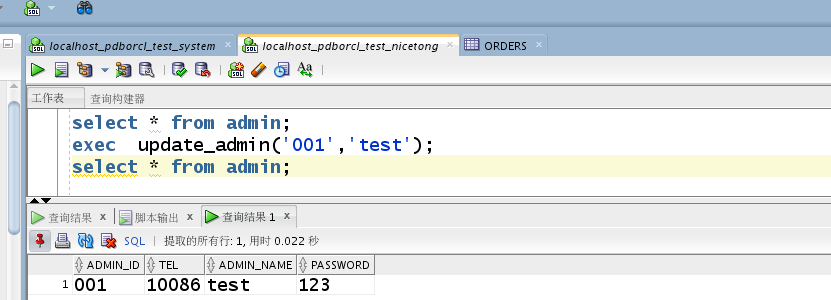图 7-2&nbsp;甜点商城测试更新管理员密码的存储过程

&nbsp;

7.2创建一个存储过程，修改admin表中的tel字段。

<table>
<tbody>
<tr>
<td width="568">

create or replace procedure update_adminTel

(

v_admin_id &nbsp;varchar2,

v_admin_tel varchar2

) is

begin

update admin set tel=v_admin_tel where admin_id=v_admin_id; &nbsp;

end update_adminTel;

</td>
</tr>
</tbody>
</table>

&nbsp;

&nbsp;

&nbsp;

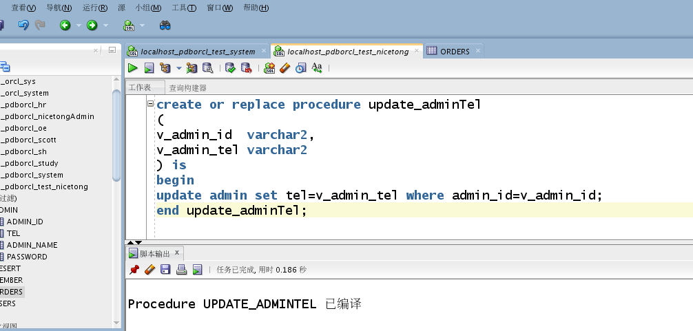图 7-3&nbsp;甜点商城创建更新管理员联系电话的存储过程

测试存储过程：

<table>
<tbody>
<tr>
<td width="568">

select * from admin;

exec &nbsp;update_adminTel('001','123456');

select * from admin;

</td>
</tr>
</tbody>
</table>

&nbsp;

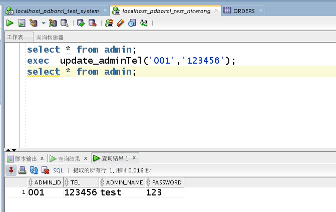图 7-4&nbsp;甜点商城测试更新管理员联系电话的存储过程

&nbsp;

&nbsp;

&nbsp;

7.3创建一个存储过程，查看admin表中根据admin_id查询出admin的name

<table>
<tbody>
<tr>
<td width="568">

create or replace procedure admin_out_name

&nbsp;(

&nbsp;v_admin_id in VARCHAR2,

&nbsp;v_name out VARCHAR2

&nbsp;) is

vname &nbsp;VARCHAR2(10) ;

&nbsp;begin

&nbsp;select admin_name into vname from admin where admin_id=v_admin_id;

&nbsp;v_name:=vname;

&nbsp;end;

</td>
</tr>
</tbody>
</table>

<strong><strong>&nbsp;</strong></strong>

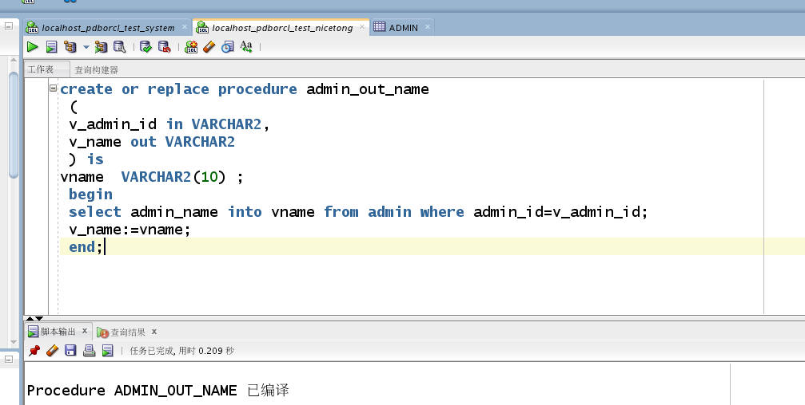图 7-5&nbsp;甜点商城创建查看管理员name的存储过程

测试存储过程：

<table>
<tbody>
<tr>
<td width="568">

var vname VARCHAR2

exec &nbsp;admin_out_name('001',:vname);

</td>
</tr>
</tbody>
</table>

&nbsp;

&nbsp;

&nbsp;

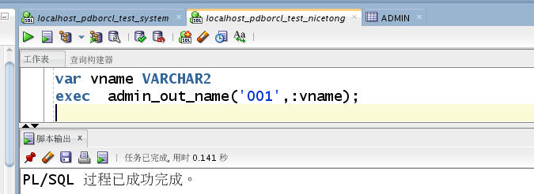图 7-6&nbsp;甜点商城测试查看管理员name的存储过程

&nbsp;

&nbsp;

7.4创建程序包

本系统设计了一些函数及过程，共用的一些程序包放在程序包MyPack中。其他的程序包放在自己的包中。包用于组合逻辑相关的过程和函数，它由包规范和包体两个部分组成。包规范用于定义公用的常量、变量、过程和函数，创建包规范可以使用CREATE PACKAGE命令，创建包体可以使用CREATE PACKAGE BODY。

<table>
<tbody>
<tr>
<td width="568">

&nbsp;create package admin_pkg is

&nbsp;procedure admin_update_Tel(v_admin_id varchar2,v_admin_tel varchar2);

&nbsp;function admin_get_name(v_admin_id varchar2) return varchar2;

&nbsp;end;

</td>
</tr>
</tbody>
</table>

&nbsp;

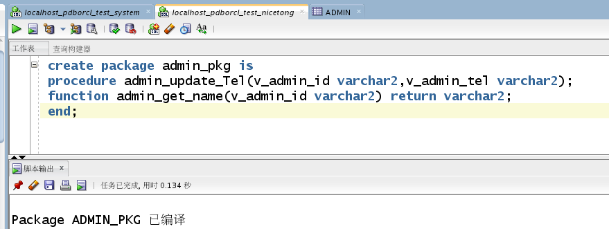图 7-7&nbsp;甜点商城创建关于admin表的程序包

创建关于admin表程序包admin_pkg的包体：

<table>
<tbody>
<tr>
<td width="568">

create or replace package body admin_pkg

is

&nbsp;&nbsp;&nbsp;procedure admin_update_Tel

&nbsp;&nbsp;&nbsp;&nbsp;(

&nbsp;&nbsp;&nbsp;&nbsp;v_admin_id &nbsp;varchar2,

&nbsp;&nbsp;&nbsp;&nbsp;v_admin_tel varchar2

&nbsp;&nbsp;&nbsp;&nbsp;) is

&nbsp;&nbsp;&nbsp;&nbsp;begin

&nbsp;&nbsp;&nbsp;&nbsp;update admin set tel=v_admin_tel where admin_id=v_admin_id; &nbsp;

&nbsp;&nbsp;&nbsp;&nbsp;end;

&nbsp;&nbsp;&nbsp;&nbsp;

&nbsp;&nbsp;&nbsp;&nbsp;function admin_get_name

&nbsp;&nbsp;&nbsp;&nbsp;(

&nbsp;&nbsp;&nbsp;&nbsp;v_admin_id varchar2

&nbsp;&nbsp;&nbsp;&nbsp;)

&nbsp;&nbsp;&nbsp;&nbsp;return varchar2 is

&nbsp;&nbsp;&nbsp;&nbsp;vname varchar2(10);

&nbsp;&nbsp;&nbsp;&nbsp;begin

&nbsp;&nbsp;&nbsp;&nbsp;select admin_name into vname from admin where admin_id= v_admin_id;

&nbsp;&nbsp;&nbsp;&nbsp;return vname;

</td>
</tr>
</tbody>
</table>

&nbsp;

&nbsp;

&nbsp;

&nbsp;

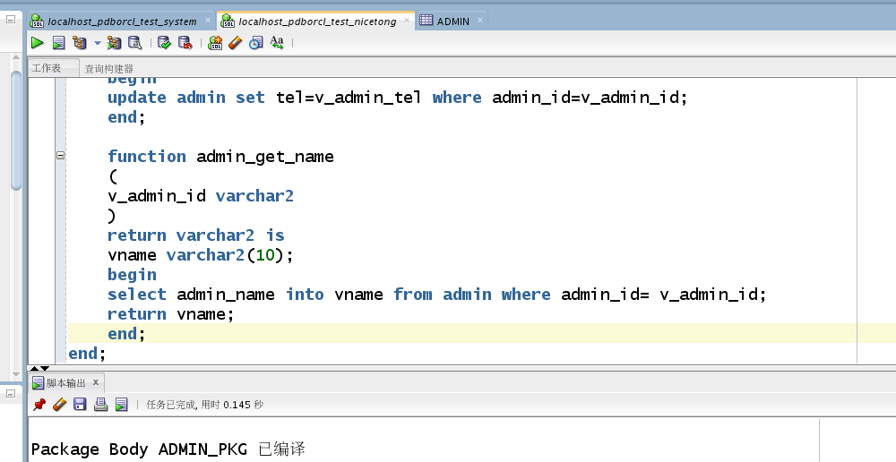图 7-8 甜点商城创建关于admin表的程序包的包体

注意：

在此提示，在没有创建包规范就创建包体，会失败，要使用包，必须先创建包规范，然后在创建包体当要调用包的过程和函数时，在过程和函数的名称前加上包名作为前缀（包名.子程序名称），而如果要访问其他方案的包时需要在包的名称前加上方案的名称（方案名称.包名.子程序名称）

测试admin_pkg的程序包：

<table>
<tbody>
<tr>
<td width="568">

select admin_pkg.admin_get_name('001') from dual;

</td>
</tr>
</tbody>
</table>

&nbsp;

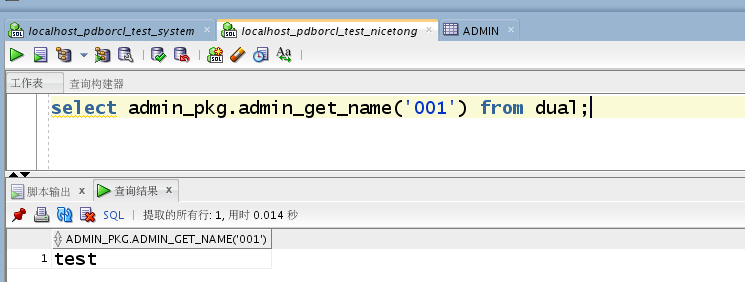图 7-9 甜点商城测试admin程序包的函数

<table>
<tbody>
<tr>
<td width="568">

exec admin_pkg.admin_update_Tel('001','3333');

select * from admin where admin_id='001';

</td>
</tr>
</tbody>
</table>

&nbsp;

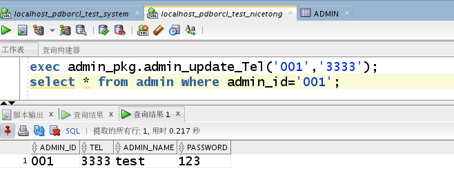图 7-10甜点商城测试admin程序包的函数

&nbsp;

&nbsp;

&nbsp;

<ol start="8">
<li>数据库备份</li>
</ol>

本实验使用老师的虚拟机，通过rman_level0.sh和rman_level1.sh脚本对数据库进行全备份和全恢复，在数据库出现异常时候，不损失任何数据！

8.1开始全备份

通过rman_level0.sh和rman_level1.sh脚本对数据库进行全备份和全恢复。

<table>
<tbody>
<tr>
<td width="568">

[oracle@oracle-pc ~]$ cat rman_level0.sh

[oracle@oracle-pc ~]$ ./rman_level0.sh

</td>
</tr>
</tbody>
</table>

&nbsp;

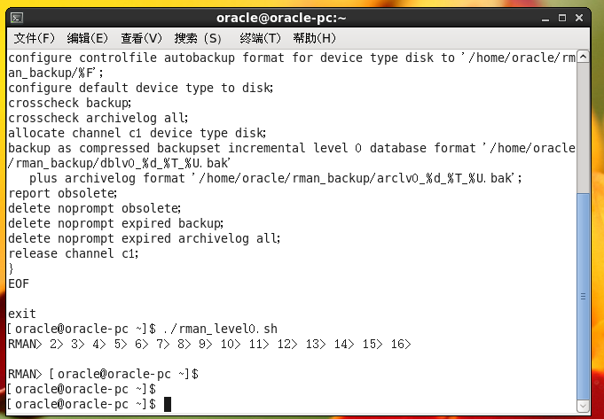图 8-1 甜点商城开始全备份

每天定时开始增量备份（可选）

<table>
<tbody>
<tr>
<td width="568">

[oracle@oracle-pc ~]$ cat rman_level1.sh

[oracle@oracle-pc ~]$ ./rman_level1.sh

</td>
</tr>
</tbody>
</table>

&nbsp;

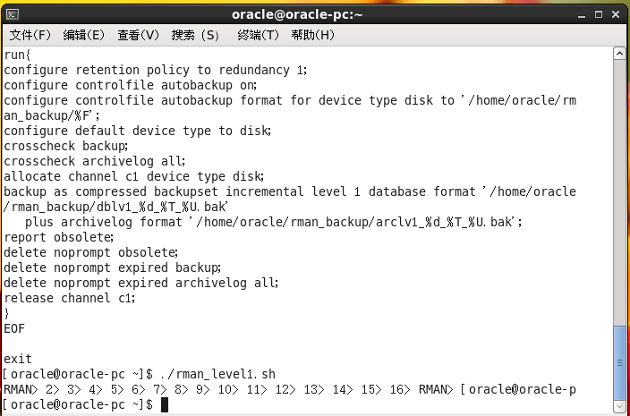图 8-2 甜点商城每天定时开始增量备份

&nbsp;

查看备份文件

<table>
<tbody>
<tr>
<td width="568">

[oracle@oracle-pc ~]$ cd rman_backup

[oracle@oracle-pc rman_backup]$ ls

arclv0_ORCL_20191124_9fuhmdgk_1_1.bak &nbsp;dblv1_ORCL_20191124_9iuhmdp6_1_1.bak

arclv1_ORCL_20191124_9huhmdp5_1_1.bak &nbsp;dblv1_ORCL_20191124_9juhmdrr_1_1.bak

arclv1_ORCL_20191124_9muhmdud_1_1.bak &nbsp;dblv1_ORCL_20191124_9kuhmdtj_1_1.bak

c-1392946895-20191124-01 &nbsp;&nbsp;&nbsp;&nbsp;&nbsp;&nbsp;&nbsp;&nbsp;&nbsp;&nbsp;&nbsp;&nbsp;&nbsp;&nbsp;lv0_20191111-003303_L0.log

dblv0_ORCL_20191124_9buhmd53_1_1.bak &nbsp;&nbsp;lv0_20191124-155112_L0.log

dblv0_ORCL_20191124_9cuhmd92_1_1.bak &nbsp;&nbsp;lv1_20191111-003650_L0.log

dblv0_ORCL_20191124_9duhmdce_1_1.bak &nbsp;&nbsp;lv1_20191124-160237_L0.log

dblv0_ORCL_20191124_9euhmde6_1_1.bak

</td>
</tr>
</tbody>
</table>

&nbsp;

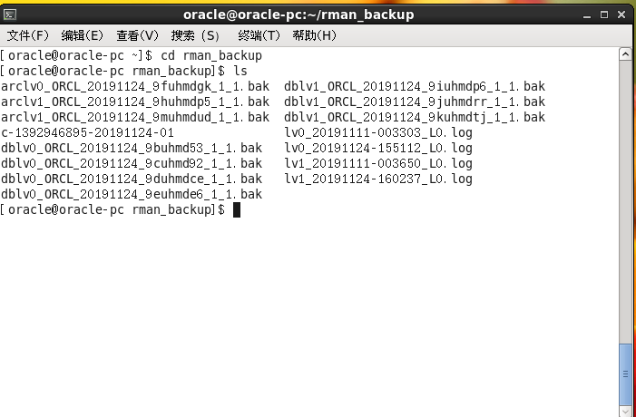图 8-3 甜点商城查看备份文件

查看备份文件的内容

<table>
<tbody>
<tr>
<td width="568">

[oracle@oracle-pc ~]$ &nbsp;rman target /

&nbsp;

Recovery Manager: Release 12.1.0.2.0 - Production on 星期日 11月 24 16:11:44 2019

&nbsp;

Copyright (c) 1982, 2014, Oracle and/or its affiliates. &nbsp;All rights reserved.

&nbsp;

connected to target database: ORCL (DBID=1392946895)

&nbsp;

RMAN&gt; list backup;

&nbsp;

using target database control file instead of recovery catalog

&nbsp;

List of Backup Sets

===================

&nbsp;

&nbsp;

BS Key &nbsp;Type LV Size &nbsp;&nbsp;&nbsp;&nbsp;&nbsp;&nbsp;Device Type Elapsed Time Completion Time

------- ---- -- ---------- ----------- ------------ ---------------

251 &nbsp;&nbsp;&nbsp;&nbsp;Incr 0 &nbsp;215.20M &nbsp;&nbsp;&nbsp;DISK &nbsp;&nbsp;&nbsp;&nbsp;&nbsp;&nbsp;&nbsp;00:01:59 &nbsp;&nbsp;&nbsp;&nbsp;24-11月-19 &nbsp;&nbsp;&nbsp;

&nbsp;&nbsp;&nbsp;&nbsp;&nbsp;&nbsp;&nbsp;&nbsp;BP Key: 251 &nbsp;&nbsp;Status: AVAILABLE &nbsp;Compressed: YES &nbsp;Tag: TAG20191124T155203

&nbsp;&nbsp;&nbsp;&nbsp;&nbsp;&nbsp;&nbsp;&nbsp;Piece Name: /home/oracle/rman_backup/dblv0_ORCL_20191124_9buhmd53_1_1.bak

&nbsp;&nbsp;List of Datafiles in backup set 251

&nbsp;&nbsp;Container ID: 3, PDB Name: PDBORCL

&nbsp;&nbsp;File LV Type Ckp SCN &nbsp;&nbsp;&nbsp;Ckp Time &nbsp;&nbsp;Name

&nbsp;&nbsp;---- -- ---- ---------- ---------- ----

&nbsp;&nbsp;8 &nbsp;&nbsp;&nbsp;0 &nbsp;Incr 47254373 &nbsp;&nbsp;24-11月-19 /home/oracle/app/oracle/oradata/orcl/pdborcl/system01.dbf

&nbsp;&nbsp;9 &nbsp;&nbsp;&nbsp;0 &nbsp;Incr 47254373 &nbsp;&nbsp;24-11月-19 /home/oracle/app/oracle/oradata/orcl/pdborcl/sysaux01.dbf

&nbsp;&nbsp;10 &nbsp;&nbsp;0 &nbsp;Incr 47254373 &nbsp;&nbsp;24-11月-19 /home/oracle/app/oracle/oradata/orcl/pdborcl/SAMPLE_SCHEMA_users01.dbf

&nbsp;&nbsp;11 &nbsp;&nbsp;0 &nbsp;Incr 47254373 &nbsp;&nbsp;24-11月-19 /home/oracle/app/oracle/oradata/orcl/pdborcl/example01.dbf

&nbsp;&nbsp;12 &nbsp;&nbsp;0 &nbsp;Incr 47254373 &nbsp;&nbsp;24-11月-19 /home/oracle/app/oracle/oradata/orcl/pdborcl/pdbtest_users02_1.dbf

&nbsp;&nbsp;13 &nbsp;&nbsp;0 &nbsp;Incr 47254373 &nbsp;&nbsp;24-11月-19 /home/oracle/app/oracle/oradata/orcl/pdborcl/pdbtest_users02_2.dbf

&nbsp;&nbsp;16 &nbsp;&nbsp;0 &nbsp;Incr 47254373 &nbsp;&nbsp;24-11月-19 /home/oracle/app/oracle/oradata/orcl/pdborcl/pdbtest_users02_3.dbf

&nbsp;&nbsp;17 &nbsp;&nbsp;0 &nbsp;Incr 47254373 &nbsp;&nbsp;24-11月-19 /home/oracle/app/oracle/oradata/orcl/pdborcl/pdbtest_users02_4.dbf

&nbsp;&nbsp;77 &nbsp;&nbsp;0 &nbsp;Incr 47254373 &nbsp;&nbsp;24-11月-19 /home/oracle/app/oracle/oradata/orcl/pdborcl/pdbtest_users03_1.dbf

&nbsp;&nbsp;78 &nbsp;&nbsp;0 &nbsp;Incr 47254373 &nbsp;&nbsp;24-11月-19 /home/oracle/app/oracle/oradata/orcl/pdborcl/pdbtest_users03_2.dbf

&nbsp;

BS Key &nbsp;Type LV Size &nbsp;&nbsp;&nbsp;&nbsp;&nbsp;&nbsp;Device Type Elapsed Time Completion Time

------- ---- -- ---------- ----------- ------------ ---------------

252 &nbsp;&nbsp;&nbsp;&nbsp;Incr 0 &nbsp;369.77M &nbsp;&nbsp;&nbsp;DISK &nbsp;&nbsp;&nbsp;&nbsp;&nbsp;&nbsp;&nbsp;00:01:42 &nbsp;&nbsp;&nbsp;&nbsp;24-11月-19 &nbsp;&nbsp;&nbsp;

&nbsp;&nbsp;&nbsp;&nbsp;&nbsp;&nbsp;&nbsp;&nbsp;BP Key: 252 &nbsp;&nbsp;Status: AVAILABLE &nbsp;Compressed: YES &nbsp;Tag: TAG20191124T155203

&nbsp;&nbsp;&nbsp;&nbsp;&nbsp;&nbsp;&nbsp;&nbsp;Piece Name: /home/oracle/rman_backup/dblv0_ORCL_20191124_9cuhmd92_1_1.bak

&nbsp;&nbsp;List of Datafiles in backup set 252

&nbsp;&nbsp;File LV Type Ckp SCN &nbsp;&nbsp;&nbsp;Ckp Time &nbsp;&nbsp;Name

&nbsp;&nbsp;---- -- ---- ---------- ---------- ----

&nbsp;&nbsp;1 &nbsp;&nbsp;&nbsp;0 &nbsp;Incr 47254431 &nbsp;&nbsp;24-11月-19 /home/oracle/app/oracle/oradata/orcl/system01.dbf

&nbsp;&nbsp;3 &nbsp;&nbsp;&nbsp;0 &nbsp;Incr 47254431 &nbsp;&nbsp;24-11月-19 /home/oracle/app/oracle/oradata/orcl/sysaux01.dbf

&nbsp;&nbsp;4 &nbsp;&nbsp;&nbsp;0 &nbsp;Incr 47254431 &nbsp;&nbsp;24-11月-19 /home/oracle/app/oracle/oradata/orcl/undotbs01.dbf

&nbsp;&nbsp;6 &nbsp;&nbsp;&nbsp;0 &nbsp;Incr 47254431 &nbsp;&nbsp;24-11月-19 /home/oracle/app/oracle/oradata/orcl/users01.dbf

&nbsp;

BS Key &nbsp;Type LV Size &nbsp;&nbsp;&nbsp;&nbsp;&nbsp;&nbsp;Device Type Elapsed Time Completion Time

------- ---- -- ---------- ----------- ------------ ---------------

253 &nbsp;&nbsp;&nbsp;&nbsp;Incr 0 &nbsp;160.44M &nbsp;&nbsp;&nbsp;DISK &nbsp;&nbsp;&nbsp;&nbsp;&nbsp;&nbsp;&nbsp;00:00:47 &nbsp;&nbsp;&nbsp;&nbsp;24-11月-19 &nbsp;&nbsp;&nbsp;

&nbsp;&nbsp;&nbsp;&nbsp;&nbsp;&nbsp;&nbsp;&nbsp;BP Key: 253 &nbsp;&nbsp;Status: AVAILABLE &nbsp;Compressed: YES &nbsp;Tag: TAG20191124T155203

&nbsp;&nbsp;&nbsp;&nbsp;&nbsp;&nbsp;&nbsp;&nbsp;Piece Name: /home/oracle/rman_backup/dblv0_ORCL_20191124_9duhmdce_1_1.bak

&nbsp;&nbsp;List of Datafiles in backup set 253

&nbsp;&nbsp;Container ID: 4, PDB Name: LOCALHOST_PDBORCL_TEST

&nbsp;&nbsp;File LV Type Ckp SCN &nbsp;&nbsp;&nbsp;Ckp Time &nbsp;&nbsp;Name

&nbsp;&nbsp;---- -- ---- ---------- ---------- ----

&nbsp;&nbsp;79 &nbsp;&nbsp;0 &nbsp;Incr 47254493 &nbsp;&nbsp;24-11月-19 /home/oracle/app/oracle/oradata/orcl/localhost_pdborcl_test/system01.dbf

&nbsp;&nbsp;80 &nbsp;&nbsp;0 &nbsp;Incr 47254493 &nbsp;&nbsp;24-11月-19 /home/oracle/app/oracle/oradata/orcl/localhost_pdborcl_test/sysaux01.dbf

&nbsp;&nbsp;81 &nbsp;&nbsp;0 &nbsp;Incr 47254493 &nbsp;&nbsp;24-11月-19 /home/oracle/app/oracle/oradata/orcl/localhost_pdborcl_test/localhost_pdborcl_test_users01.dbf

&nbsp;&nbsp;82 &nbsp;&nbsp;0 &nbsp;Incr 47254493 &nbsp;&nbsp;24-11月-19 /home/oracle/app/oracle/oradata/orcl/pdborcl/pdbtest_nicetong1.dbf

&nbsp;&nbsp;83 &nbsp;&nbsp;0 &nbsp;Incr 47254493 &nbsp;&nbsp;24-11月-19 /home/oracle/app/oracle/oradata/orcl/pdborcl/pdbtest_nicetong2.dbf

&nbsp;

BS Key &nbsp;Type LV Size &nbsp;&nbsp;&nbsp;&nbsp;&nbsp;&nbsp;Device Type Elapsed Time Completion Time

------- ---- -- ---------- ----------- ------------ ---------------

254 &nbsp;&nbsp;&nbsp;&nbsp;Incr 0 &nbsp;157.08M &nbsp;&nbsp;&nbsp;DISK &nbsp;&nbsp;&nbsp;&nbsp;&nbsp;&nbsp;&nbsp;00:01:11 &nbsp;&nbsp;&nbsp;&nbsp;24-11月-19 &nbsp;&nbsp;&nbsp;

&nbsp;&nbsp;&nbsp;&nbsp;&nbsp;&nbsp;&nbsp;&nbsp;BP Key: 254 &nbsp;&nbsp;Status: AVAILABLE &nbsp;Compressed: YES &nbsp;Tag: TAG20191124T155203

&nbsp;&nbsp;&nbsp;&nbsp;&nbsp;&nbsp;&nbsp;&nbsp;Piece Name: /home/oracle/rman_backup/dblv0_ORCL_20191124_9euhmde6_1_1.bak

&nbsp;&nbsp;List of Datafiles in backup set 254

&nbsp;&nbsp;Container ID: 2, PDB Name: PDB$SEED

&nbsp;&nbsp;File LV Type Ckp SCN &nbsp;&nbsp;&nbsp;Ckp Time &nbsp;&nbsp;Name

&nbsp;&nbsp;---- -- ---- ---------- ---------- ----

&nbsp;&nbsp;5 &nbsp;&nbsp;&nbsp;0 &nbsp;Incr 1819408 &nbsp;&nbsp;&nbsp;01-12月-14 /home/oracle/app/oracle/oradata/orcl/pdbseed/system01.dbf

&nbsp;&nbsp;7 &nbsp;&nbsp;&nbsp;0 &nbsp;Incr 1819408 &nbsp;&nbsp;&nbsp;01-12月-14 /home/oracle/app/oracle/oradata/orcl/pdbseed/sysaux01.dbf

&nbsp;

BS Key &nbsp;Size &nbsp;&nbsp;&nbsp;&nbsp;&nbsp;&nbsp;Device Type Elapsed Time Completion Time

------- ---------- ----------- ------------ ---------------

255 &nbsp;&nbsp;&nbsp;&nbsp;67.50K &nbsp;&nbsp;&nbsp;&nbsp;DISK &nbsp;&nbsp;&nbsp;&nbsp;&nbsp;&nbsp;&nbsp;00:00:00 &nbsp;&nbsp;&nbsp;&nbsp;24-11月-19 &nbsp;&nbsp;&nbsp;

&nbsp;&nbsp;&nbsp;&nbsp;&nbsp;&nbsp;&nbsp;&nbsp;BP Key: 255 &nbsp;&nbsp;Status: AVAILABLE &nbsp;Compressed: YES &nbsp;Tag: TAG20191124T155811

&nbsp;&nbsp;&nbsp;&nbsp;&nbsp;&nbsp;&nbsp;&nbsp;Piece Name: /home/oracle/rman_backup/arclv0_ORCL_20191124_9fuhmdgk_1_1.bak

&nbsp;

&nbsp;&nbsp;List of Archived Logs in backup set 255

&nbsp;&nbsp;Thrd Seq &nbsp;&nbsp;&nbsp;&nbsp;Low SCN &nbsp;&nbsp;&nbsp;Low Time &nbsp;&nbsp;Next SCN &nbsp;&nbsp;Next Time

&nbsp;&nbsp;---- ------- ---------- ---------- ---------- ---------

&nbsp;&nbsp;1 &nbsp;&nbsp;&nbsp;1616 &nbsp;&nbsp;&nbsp;47254352 &nbsp;&nbsp;24-11月-19 47254544 &nbsp;&nbsp;24-11月-19

&nbsp;

BS Key &nbsp;Size &nbsp;&nbsp;&nbsp;&nbsp;&nbsp;&nbsp;Device Type Elapsed Time Completion Time

------- ---------- ----------- ------------ ---------------

257 &nbsp;&nbsp;&nbsp;&nbsp;1.91M &nbsp;&nbsp;&nbsp;&nbsp;&nbsp;DISK &nbsp;&nbsp;&nbsp;&nbsp;&nbsp;&nbsp;&nbsp;00:00:00 &nbsp;&nbsp;&nbsp;&nbsp;24-11月-19 &nbsp;&nbsp;&nbsp;

&nbsp;&nbsp;&nbsp;&nbsp;&nbsp;&nbsp;&nbsp;&nbsp;BP Key: 257 &nbsp;&nbsp;Status: AVAILABLE &nbsp;Compressed: YES &nbsp;Tag: TAG20191124T160245

&nbsp;&nbsp;&nbsp;&nbsp;&nbsp;&nbsp;&nbsp;&nbsp;Piece Name: /home/oracle/rman_backup/arclv1_ORCL_20191124_9huhmdp5_1_1.bak

&nbsp;

&nbsp;&nbsp;List of Archived Logs in backup set 257

&nbsp;&nbsp;Thrd Seq &nbsp;&nbsp;&nbsp;&nbsp;Low SCN &nbsp;&nbsp;&nbsp;Low Time &nbsp;&nbsp;Next SCN &nbsp;&nbsp;Next Time

&nbsp;&nbsp;---- ------- ---------- ---------- ---------- ---------

&nbsp;&nbsp;1 &nbsp;&nbsp;&nbsp;1616 &nbsp;&nbsp;&nbsp;47254352 &nbsp;&nbsp;24-11月-19 47254544 &nbsp;&nbsp;24-11月-19

&nbsp;&nbsp;1 &nbsp;&nbsp;&nbsp;1617 &nbsp;&nbsp;&nbsp;47254544 &nbsp;&nbsp;24-11月-19 47255360 &nbsp;&nbsp;24-11月-19

&nbsp;

BS Key &nbsp;Type LV Size &nbsp;&nbsp;&nbsp;&nbsp;&nbsp;&nbsp;Device Type Elapsed Time Completion Time

------- ---- -- ---------- ----------- ------------ ---------------

258 &nbsp;&nbsp;&nbsp;&nbsp;Incr 1 &nbsp;328.00K &nbsp;&nbsp;&nbsp;DISK &nbsp;&nbsp;&nbsp;&nbsp;&nbsp;&nbsp;&nbsp;00:01:24 &nbsp;&nbsp;&nbsp;&nbsp;24-11月-19 &nbsp;&nbsp;&nbsp;

&nbsp;&nbsp;&nbsp;&nbsp;&nbsp;&nbsp;&nbsp;&nbsp;BP Key: 258 &nbsp;&nbsp;Status: AVAILABLE &nbsp;Compressed: YES &nbsp;Tag: TAG20191124T160246

&nbsp;&nbsp;&nbsp;&nbsp;&nbsp;&nbsp;&nbsp;&nbsp;Piece Name: /home/oracle/rman_backup/dblv1_ORCL_20191124_9iuhmdp6_1_1.bak

&nbsp;&nbsp;List of Datafiles in backup set 258

&nbsp;&nbsp;Container ID: 3, PDB Name: PDBORCL

&nbsp;&nbsp;File LV Type Ckp SCN &nbsp;&nbsp;&nbsp;Ckp Time &nbsp;&nbsp;Name

&nbsp;&nbsp;---- -- ---- ---------- ---------- ----

&nbsp;&nbsp;8 &nbsp;&nbsp;&nbsp;1 &nbsp;Incr 47255370 &nbsp;&nbsp;24-11月-19 /home/oracle/app/oracle/oradata/orcl/pdborcl/system01.dbf

&nbsp;&nbsp;9 &nbsp;&nbsp;&nbsp;1 &nbsp;Incr 47255370 &nbsp;&nbsp;24-11月-19 /home/oracle/app/oracle/oradata/orcl/pdborcl/sysaux01.dbf

&nbsp;&nbsp;10 &nbsp;&nbsp;1 &nbsp;Incr 47255370 &nbsp;&nbsp;24-11月-19 /home/oracle/app/oracle/oradata/orcl/pdborcl/SAMPLE_SCHEMA_users01.dbf

&nbsp;&nbsp;11 &nbsp;&nbsp;1 &nbsp;Incr 47255370 &nbsp;&nbsp;24-11月-19 /home/oracle/app/oracle/oradata/orcl/pdborcl/example01.dbf

&nbsp;&nbsp;12 &nbsp;&nbsp;1 &nbsp;Incr 47255370 &nbsp;&nbsp;24-11月-19 /home/oracle/app/oracle/oradata/orcl/pdborcl/pdbtest_users02_1.dbf

&nbsp;&nbsp;13 &nbsp;&nbsp;1 &nbsp;Incr 47255370 &nbsp;&nbsp;24-11月-19 /home/oracle/app/oracle/oradata/orcl/pdborcl/pdbtest_users02_2.dbf

&nbsp;&nbsp;16 &nbsp;&nbsp;1 &nbsp;Incr 47255370 &nbsp;&nbsp;24-11月-19 /home/oracle/app/oracle/oradata/orcl/pdborcl/pdbtest_users02_3.dbf

&nbsp;&nbsp;17 &nbsp;&nbsp;1 &nbsp;Incr 47255370 &nbsp;&nbsp;24-11月-19 /home/oracle/app/oracle/oradata/orcl/pdborcl/pdbtest_users02_4.dbf

&nbsp;&nbsp;77 &nbsp;&nbsp;1 &nbsp;Incr 47255370 &nbsp;&nbsp;24-11月-19 /home/oracle/app/oracle/oradata/orcl/pdborcl/pdbtest_users03_1.dbf

&nbsp;&nbsp;78 &nbsp;&nbsp;1 &nbsp;Incr 47255370 &nbsp;&nbsp;24-11月-19 /home/oracle/app/oracle/oradata/orcl/pdborcl/pdbtest_users03_2.dbf

&nbsp;

BS Key &nbsp;Type LV Size &nbsp;&nbsp;&nbsp;&nbsp;&nbsp;&nbsp;Device Type Elapsed Time Completion Time

------- ---- -- ---------- ----------- ------------ ---------------

259 &nbsp;&nbsp;&nbsp;&nbsp;Incr 1 &nbsp;2.34M &nbsp;&nbsp;&nbsp;&nbsp;&nbsp;DISK &nbsp;&nbsp;&nbsp;&nbsp;&nbsp;&nbsp;&nbsp;00:00:49 &nbsp;&nbsp;&nbsp;&nbsp;24-11月-19 &nbsp;&nbsp;&nbsp;

&nbsp;&nbsp;&nbsp;&nbsp;&nbsp;&nbsp;&nbsp;&nbsp;BP Key: 259 &nbsp;&nbsp;Status: AVAILABLE &nbsp;Compressed: YES &nbsp;Tag: TAG20191124T160246

&nbsp;&nbsp;&nbsp;&nbsp;&nbsp;&nbsp;&nbsp;&nbsp;Piece Name: /home/oracle/rman_backup/dblv1_ORCL_20191124_9juhmdrr_1_1.bak

&nbsp;&nbsp;List of Datafiles in backup set 259

&nbsp;&nbsp;File LV Type Ckp SCN &nbsp;&nbsp;&nbsp;Ckp Time &nbsp;&nbsp;Name

&nbsp;&nbsp;---- -- ---- ---------- ---------- ----

&nbsp;&nbsp;1 &nbsp;&nbsp;&nbsp;1 &nbsp;Incr 47255497 &nbsp;&nbsp;24-11月-19 /home/oracle/app/oracle/oradata/orcl/system01.dbf

&nbsp;&nbsp;3 &nbsp;&nbsp;&nbsp;1 &nbsp;Incr 47255497 &nbsp;&nbsp;24-11月-19 /home/oracle/app/oracle/oradata/orcl/sysaux01.dbf

&nbsp;&nbsp;4 &nbsp;&nbsp;&nbsp;1 &nbsp;Incr 47255497 &nbsp;&nbsp;24-11月-19 /home/oracle/app/oracle/oradata/orcl/undotbs01.dbf

&nbsp;&nbsp;6 &nbsp;&nbsp;&nbsp;1 &nbsp;Incr 47255497 &nbsp;&nbsp;24-11月-19 /home/oracle/app/oracle/oradata/orcl/users01.dbf

&nbsp;

BS Key &nbsp;Type LV Size &nbsp;&nbsp;&nbsp;&nbsp;&nbsp;&nbsp;Device Type Elapsed Time Completion Time

------- ---- -- ---------- ----------- ------------ ---------------

260 &nbsp;&nbsp;&nbsp;&nbsp;Incr 1 &nbsp;208.00K &nbsp;&nbsp;&nbsp;DISK &nbsp;&nbsp;&nbsp;&nbsp;&nbsp;&nbsp;&nbsp;00:00:23 &nbsp;&nbsp;&nbsp;&nbsp;24-11月-19 &nbsp;&nbsp;&nbsp;

&nbsp;&nbsp;&nbsp;&nbsp;&nbsp;&nbsp;&nbsp;&nbsp;BP Key: 260 &nbsp;&nbsp;Status: AVAILABLE &nbsp;Compressed: YES &nbsp;Tag: TAG20191124T160246

&nbsp;&nbsp;&nbsp;&nbsp;&nbsp;&nbsp;&nbsp;&nbsp;Piece Name: /home/oracle/rman_backup/dblv1_ORCL_20191124_9kuhmdtj_1_1.bak

&nbsp;&nbsp;List of Datafiles in backup set 260

&nbsp;&nbsp;Container ID: 4, PDB Name: LOCALHOST_PDBORCL_TEST

&nbsp;&nbsp;File LV Type Ckp SCN &nbsp;&nbsp;&nbsp;Ckp Time &nbsp;&nbsp;Name

&nbsp;&nbsp;---- -- ---- ---------- ---------- ----

&nbsp;&nbsp;79 &nbsp;&nbsp;1 &nbsp;Incr 47255538 &nbsp;&nbsp;24-11月-19 /home/oracle/app/oracle/oradata/orcl/localhost_pdborcl_test/system01.dbf

&nbsp;&nbsp;80 &nbsp;&nbsp;1 &nbsp;Incr 47255538 &nbsp;&nbsp;24-11月-19 /home/oracle/app/oracle/oradata/orcl/localhost_pdborcl_test/sysaux01.dbf

&nbsp;&nbsp;81 &nbsp;&nbsp;1 &nbsp;Incr 47255538 &nbsp;&nbsp;24-11月-19 /home/oracle/app/oracle/oradata/orcl/localhost_pdborcl_test/localhost_pdborcl_test_users01.dbf

&nbsp;&nbsp;82 &nbsp;&nbsp;1 &nbsp;Incr 47255538 &nbsp;&nbsp;24-11月-19 /home/oracle/app/oracle/oradata/orcl/pdborcl/pdbtest_nicetong1.dbf

&nbsp;&nbsp;83 &nbsp;&nbsp;1 &nbsp;Incr 47255538 &nbsp;&nbsp;24-11月-19 /home/oracle/app/oracle/oradata/orcl/pdborcl/pdbtest_nicetong2.dbf

&nbsp;

BS Key &nbsp;Size &nbsp;&nbsp;&nbsp;&nbsp;&nbsp;&nbsp;Device Type Elapsed Time Completion Time

------- ---------- ----------- ------------ ---------------

261 &nbsp;&nbsp;&nbsp;&nbsp;90.00K &nbsp;&nbsp;&nbsp;&nbsp;DISK &nbsp;&nbsp;&nbsp;&nbsp;&nbsp;&nbsp;&nbsp;00:00:00 &nbsp;&nbsp;&nbsp;&nbsp;24-11月-19 &nbsp;&nbsp;&nbsp;

&nbsp;&nbsp;&nbsp;&nbsp;&nbsp;&nbsp;&nbsp;&nbsp;BP Key: 261 &nbsp;&nbsp;Status: AVAILABLE &nbsp;Compressed: YES &nbsp;Tag: TAG20191124T160533

&nbsp;&nbsp;&nbsp;&nbsp;&nbsp;&nbsp;&nbsp;&nbsp;Piece Name: /home/oracle/rman_backup/arclv1_ORCL_20191124_9muhmdud_1_1.bak

&nbsp;

&nbsp;&nbsp;List of Archived Logs in backup set 261

&nbsp;&nbsp;Thrd Seq &nbsp;&nbsp;&nbsp;&nbsp;Low SCN &nbsp;&nbsp;&nbsp;Low Time &nbsp;&nbsp;Next SCN &nbsp;&nbsp;Next Time

&nbsp;&nbsp;---- ------- ---------- ---------- ---------- ---------

&nbsp;&nbsp;1 &nbsp;&nbsp;&nbsp;1618 &nbsp;&nbsp;&nbsp;47255360 &nbsp;&nbsp;24-11月-19 47255551 &nbsp;&nbsp;24-11月-19

&nbsp;

BS Key &nbsp;Type LV Size &nbsp;&nbsp;&nbsp;&nbsp;&nbsp;&nbsp;Device Type Elapsed Time Completion Time

------- ---- -- ---------- ----------- ------------ ---------------

262 &nbsp;&nbsp;&nbsp;&nbsp;Full &nbsp;&nbsp;&nbsp;17.77M &nbsp;&nbsp;&nbsp;&nbsp;DISK &nbsp;&nbsp;&nbsp;&nbsp;&nbsp;&nbsp;&nbsp;00:00:00 &nbsp;&nbsp;&nbsp;&nbsp;24-11月-19 &nbsp;&nbsp;&nbsp;

&nbsp;&nbsp;&nbsp;&nbsp;&nbsp;&nbsp;&nbsp;&nbsp;BP Key: 262 &nbsp;&nbsp;Status: AVAILABLE &nbsp;Compressed: NO &nbsp;Tag: TAG20191124T160534

&nbsp;&nbsp;&nbsp;&nbsp;&nbsp;&nbsp;&nbsp;&nbsp;Piece Name: /home/oracle/rman_backup/c-1392946895-20191124-01

&nbsp;&nbsp;SPFILE Included: Modification time: 24-11月-19

&nbsp;&nbsp;SPFILE db_unique_name: ORCL

&nbsp;&nbsp;Control File Included: Ckp SCN: 47255560 &nbsp;&nbsp;&nbsp;&nbsp;Ckp time: 24-11月-19

&nbsp;

RMAN&gt;

</td>
</tr>
</tbody>
</table>

由上面的"list backup;" 输出可以看出，备份集中的文件内容是：

/home/oracle/rman_backup/dblv0_ORCL_20191120_d7uhb2ap_1_1.bak 是插接数据库PDBORCL的备份集

/home/oracle/rman_backup/dblv0_ORCL_20191120_d8uhb2c6_1_1.bak 是ORCL的备份集

/home/oracle/rman_backup/dblv0_ORCL_20191120_d9uhb2ei_1_1.bak是PDB$SEED的备份集

/home/oracle/rman_backup/arclv0_ORCL_20191120_dauhb2fm_1_1.bak是归档文件的备份集

/home/oracle/rman_backup/c-1392946895-20191120-01是参数文件(SPFILE)和控制文件(Control File)的备份集

&nbsp;

&nbsp;

8.2备份后修改数据

<table>
<tbody>
<tr>
<td width="568">

[oracle@oracle-pc ~]$ sqlplus study/123@pdborcl

SQL&gt; create table t1 (id number,name varchar2(50));

Table created.

SQL&gt; insert into t1 values(1,'zhang');1 row created.

SQL&gt; commit;Commit complete.

SQL&gt; select * from t1;

&nbsp;&nbsp;&nbsp;&nbsp;&nbsp;&nbsp;&nbsp;&nbsp;ID NAME---------- --------------------------------------------------

&nbsp;&nbsp;&nbsp;&nbsp;&nbsp;&nbsp;&nbsp;&nbsp;&nbsp;1 zhang

SQL&gt; exit

&nbsp;

</td>
</tr>
</tbody>
</table>

&nbsp;

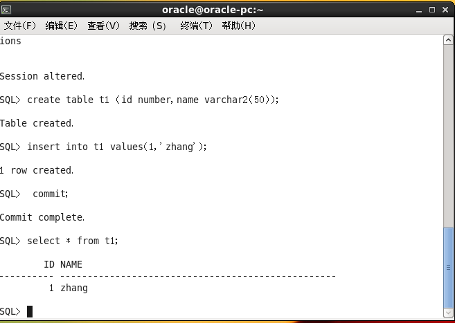图 8-4 甜点商城备份后修改文件

8.3删除数据库文件，模拟数据库文件损坏

<table>
<tbody>
<tr>
<td width="568">

[oracle@oracle-pc~]$rm&nbsp;/home/oracle/app/oracle/oradata/orcl/pdborcl/SAMPLE_SCHEMA_users01.dbf

</td>
</tr>
</tbody>
</table>

删除数据库文件后修改数据

删除数据文件后，仍然可以增加一条数据。这是因为增加的数据并没有写入数据文件，而是写到了日志文件中。如果增加的数据较多的时候，就会出问题了。

<table>
<tbody>
<tr>
<td width="568">

SQL&gt; insert into t1 values(2,'wang');

1 row created.

SQL&gt; commit;

Commit complete.

SQL&gt; select * from t1;

&nbsp;&nbsp;&nbsp;&nbsp;&nbsp;&nbsp;&nbsp;&nbsp;ID NAME

---------- --------------------------------------------------

&nbsp;&nbsp;&nbsp;&nbsp;&nbsp;&nbsp;&nbsp;&nbsp;&nbsp;2 wang

&nbsp;&nbsp;&nbsp;&nbsp;&nbsp;&nbsp;&nbsp;&nbsp;&nbsp;1 zhang

SQL&gt; &nbsp;declare

&nbsp;&nbsp;2 &nbsp;&nbsp;n number;

&nbsp;&nbsp;3 &nbsp;begin

&nbsp;&nbsp;4 &nbsp;&nbsp;for n in 1..10000 loop

&nbsp;&nbsp;5 &nbsp;&nbsp;insert into t1 values(n,'name'||n);

&nbsp;&nbsp;6 &nbsp;&nbsp;end loop;

&nbsp;&nbsp;7 &nbsp;end;

&nbsp;&nbsp;8 &nbsp;/

&nbsp;declare

*

ERROR at line 1:

ORA-01116: 打开数据库文件 10 时出错 ORA-01110:

数据文件 10: '/home/oracle/app/oracle/oradata/orcl/pdborcl/SAMPLE_SCHEMA_users01.dbf'

ORA-27041: 无法打开文件

Linux-x86_64 Error: 2: No such file or directory

Additional information: 3

ORA-06512: 在 line 5

SQL&gt; select * from t1;

&nbsp;&nbsp;&nbsp;&nbsp;&nbsp;&nbsp;&nbsp;&nbsp;ID NAME

---------- --------------------------------------------------

&nbsp;&nbsp;&nbsp;&nbsp;&nbsp;&nbsp;&nbsp;&nbsp;&nbsp;2 wang

&nbsp;&nbsp;&nbsp;&nbsp;&nbsp;&nbsp;&nbsp;&nbsp;&nbsp;1 zhang

&nbsp;

</td>
</tr>
</tbody>
</table>

&nbsp;

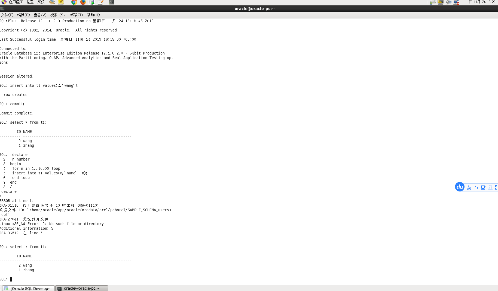图 8-5 甜点商城删除数据库文件

&nbsp;

8.4数据库完全恢复

8.4.1重启损坏的数据库到mount状态

通过shutdown immediate无法正常关闭数据库，只能通过shutdown abort强制关闭。然后将数据库启动到mount状态。

<table>
<tbody>
<tr>
<td width="568">

[oracle@oracle-pc ~]$ sqlplus / as sysdba

SQL*Plus: Release 12.1.0.2.0 Production on 星期日 11月 24 16:25:29 2019

Copyright (c) 1982, 2014, Oracle. &nbsp;All rights reserved.

Connected to:

Oracle Database 12c Enterprise Edition Release 12.1.0.2.0 - 64bit Production

With the Partitioning, OLAP, Advanced Analytics and Real Application Testing options

Session altered.

SQL&gt; shutdown immediate

ORA-01116: 打开数据库文件 10 时出错

ORA-01110: 数据文件 10: '/home/oracle/app/oracle/oradata/orcl/pdborcl/SAMPLE_SCHEMA_users01.dbf'

ORA-27041: 无法打开文件

Linux-x86_64 Error: 2: No such file or directory

Additional information: 3

SQL&gt; &nbsp;shutdown abort

ORACLE instance shut down.

SQL&gt; &nbsp;startup mount

ORACLE instance started.

Total System Global Area 1577058304 bytes

Fixed Size &nbsp;&nbsp;&nbsp;&nbsp;&nbsp;&nbsp;&nbsp;&nbsp;&nbsp;&nbsp;&nbsp;&nbsp;&nbsp;&nbsp;&nbsp;&nbsp;&nbsp;2924832 bytes

Variable Size &nbsp;&nbsp;&nbsp;&nbsp;&nbsp;&nbsp;&nbsp;&nbsp;&nbsp;&nbsp;&nbsp;&nbsp;738201312 bytes

Database Buffers &nbsp;&nbsp;&nbsp;&nbsp;&nbsp;&nbsp;&nbsp;&nbsp;&nbsp;654311424 bytes

Redo Buffers &nbsp;&nbsp;&nbsp;&nbsp;&nbsp;&nbsp;&nbsp;&nbsp;&nbsp;&nbsp;&nbsp;&nbsp;&nbsp;&nbsp;13848576 bytes

In-Memory Area &nbsp;&nbsp;&nbsp;&nbsp;&nbsp;&nbsp;&nbsp;&nbsp;&nbsp;&nbsp;&nbsp;167772160 bytes

Database mounted.

SQL&gt; exit

</td>
</tr>
</tbody>
</table>

&nbsp;

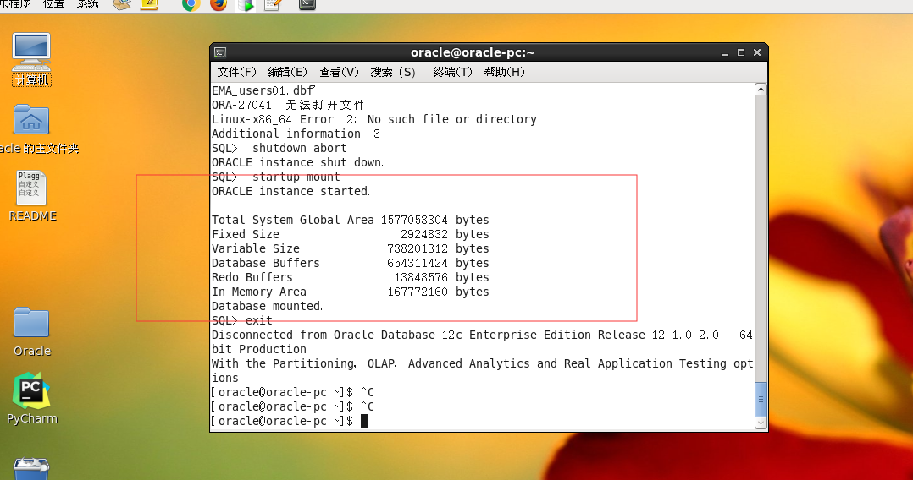图 8-6 甜点商城重启损坏的数据库到mount状态

8.4.2开始恢复数据库

<table>
<tbody>
<tr>
<td width="568">

[oracle@oracle-pc ~]$ rman target /

第一步：

RMAN&gt; restore database ;

第二步：

RMAN&gt; recover database;

第三步：

RMAN&gt; alter database open;

第四步：

RMAN&gt; exit

</td>
</tr>
</tbody>
</table>

&nbsp;

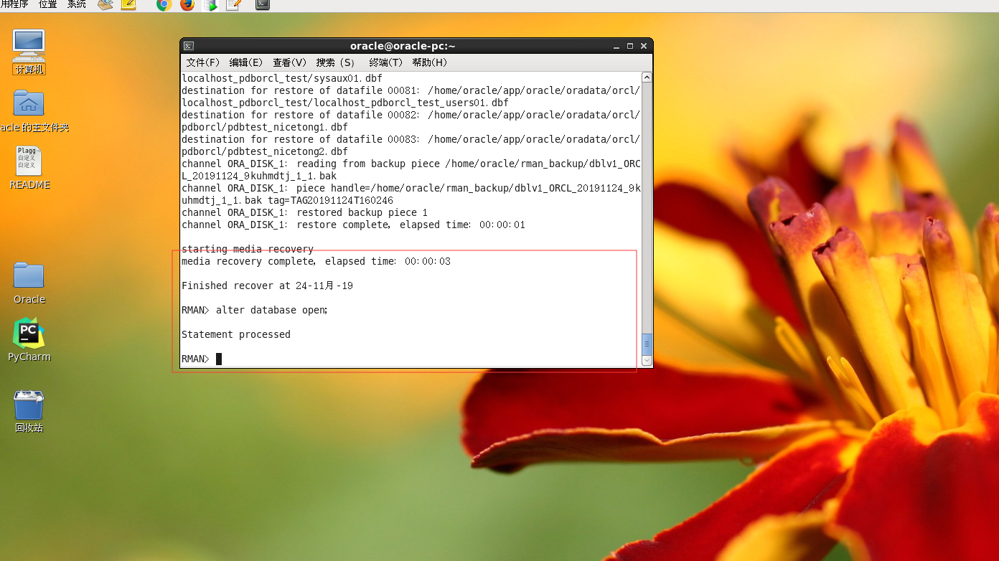图 8-7 甜点商城开始恢复数据库

&nbsp;

8.5查询数据是否恢复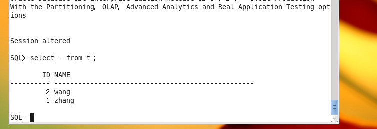

<table>
<tbody>
<tr>
<td width="568">

[oracle@oracle-pc ~]$ sqlplus study/123@pdborcl

SQL&gt; select * from t1;

&nbsp;&nbsp;&nbsp;&nbsp;&nbsp;&nbsp;&nbsp;&nbsp;ID NAME

---------- --------------------------------------------------

&nbsp;&nbsp;&nbsp;&nbsp;&nbsp;&nbsp;&nbsp;&nbsp;&nbsp;1 zhang

&nbsp;&nbsp;&nbsp;&nbsp;&nbsp;&nbsp;&nbsp;&nbsp;&nbsp;2 wang

SQL&gt;

</td>
</tr>
</tbody>
</table>

&nbsp;

由以上查询结果可见，数据100%恢复了!

9.数据库DataGuard设计

9.1oracle 12C dataguard搭建环境（主从库相同，从库只装软件不建库）

<table>
<tbody>
<tr>
<td width="568">

[oracle@oracle-pc ~]$ &nbsp;more /etc/redhat-release

CentOS release 6.9 (Final)

[oracle@oracle-pc ~]$ sqlplus

SQL*Plus: Release 12.1.0.2.0 Production on 星期日 11月 24 16:59:13 2019

Copyright (c) 1982, 2014, Oracle. &nbsp;All rights reserved.

Enter user-name: system

Enter password: ***

Last Successful login time: 星期日 11月 24 2019 12:38:12 +08:00

Connected to:

Oracle Database 12c Enterprise Edition Release 12.1.0.2.0 - 64bit Production

With the Partitioning, OLAP, Advanced Analytics and Real Application Testing options

Session altered.

SQL&gt; &nbsp;SELECT * FROM V$VERSION;

BANNER &nbsp;&nbsp;&nbsp;&nbsp;&nbsp;&nbsp;&nbsp;&nbsp;&nbsp;&nbsp;&nbsp;&nbsp;&nbsp;&nbsp;&nbsp;&nbsp;&nbsp;&nbsp;&nbsp;&nbsp;&nbsp;&nbsp;&nbsp;&nbsp;&nbsp;&nbsp;&nbsp;&nbsp;&nbsp;&nbsp;&nbsp;&nbsp;&nbsp;&nbsp;&nbsp;&nbsp;&nbsp;&nbsp;&nbsp;&nbsp;&nbsp;&nbsp;&nbsp;&nbsp;&nbsp;&nbsp;&nbsp;&nbsp;&nbsp;&nbsp;&nbsp;&nbsp;&nbsp;&nbsp;&nbsp;&nbsp;&nbsp;&nbsp;&nbsp;&nbsp;&nbsp;&nbsp;&nbsp;&nbsp;&nbsp;&nbsp;&nbsp;&nbsp;&nbsp;&nbsp;&nbsp;&nbsp;&nbsp;&nbsp;&nbsp;&nbsp;&nbsp;&nbsp;CON_ID

-------------------------------------------------------------------------------- ----------

Oracle Database 12c Enterprise Edition Release 12.1.0.2.0 - 64bit Production &nbsp;&nbsp;&nbsp;&nbsp;&nbsp;&nbsp;&nbsp;&nbsp;&nbsp;&nbsp;&nbsp;&nbsp;&nbsp;0

PL/SQL Release 12.1.0.2.0 - Production &nbsp;&nbsp;&nbsp;&nbsp;&nbsp;&nbsp;&nbsp;&nbsp;&nbsp;&nbsp;&nbsp;&nbsp;&nbsp;&nbsp;&nbsp;&nbsp;&nbsp;&nbsp;&nbsp;&nbsp;&nbsp;&nbsp;&nbsp;&nbsp;&nbsp;&nbsp;&nbsp;&nbsp;&nbsp;&nbsp;&nbsp;&nbsp;&nbsp;&nbsp;&nbsp;&nbsp;&nbsp;&nbsp;&nbsp;&nbsp;&nbsp;&nbsp;&nbsp;&nbsp;&nbsp;&nbsp;&nbsp;&nbsp;&nbsp;&nbsp;&nbsp;0

CORE 12.1.0.2.0 Production &nbsp;&nbsp;&nbsp;&nbsp;&nbsp;&nbsp;&nbsp;&nbsp;&nbsp;&nbsp;&nbsp;&nbsp;&nbsp;&nbsp;&nbsp;&nbsp;&nbsp;&nbsp;&nbsp;&nbsp;&nbsp;&nbsp;&nbsp;&nbsp;&nbsp;&nbsp;&nbsp;&nbsp;&nbsp;&nbsp;&nbsp;&nbsp;&nbsp;&nbsp;&nbsp;&nbsp;&nbsp;&nbsp;&nbsp;&nbsp;&nbsp;&nbsp;&nbsp;&nbsp;&nbsp;&nbsp;&nbsp;&nbsp;&nbsp;&nbsp;&nbsp;&nbsp;&nbsp;&nbsp;&nbsp;&nbsp;&nbsp;&nbsp;&nbsp;&nbsp;&nbsp;&nbsp;&nbsp;0

TNS for Linux: Version 12.1.0.2.0 - Production &nbsp;&nbsp;&nbsp;&nbsp;&nbsp;&nbsp;&nbsp;&nbsp;&nbsp;&nbsp;&nbsp;&nbsp;&nbsp;&nbsp;&nbsp;&nbsp;&nbsp;&nbsp;&nbsp;&nbsp;&nbsp;&nbsp;&nbsp;&nbsp;&nbsp;&nbsp;&nbsp;&nbsp;&nbsp;&nbsp;&nbsp;&nbsp;&nbsp;&nbsp;&nbsp;&nbsp;&nbsp;&nbsp;&nbsp;&nbsp;&nbsp;&nbsp;&nbsp;0

NLSRTL Version 12.1.0.2.0 - Production &nbsp;&nbsp;&nbsp;&nbsp;&nbsp;&nbsp;&nbsp;&nbsp;&nbsp;&nbsp;&nbsp;&nbsp;&nbsp;&nbsp;&nbsp;&nbsp;&nbsp;&nbsp;&nbsp;&nbsp;&nbsp;&nbsp;&nbsp;&nbsp;&nbsp;&nbsp;&nbsp;&nbsp;&nbsp;&nbsp;&nbsp;&nbsp;&nbsp;&nbsp;&nbsp;&nbsp;&nbsp;&nbsp;&nbsp;&nbsp;&nbsp;&nbsp;&nbsp;&nbsp;&nbsp;&nbsp;&nbsp;&nbsp;&nbsp;&nbsp;&nbsp;0

SQL&gt;

</td>
</tr>
</tbody>
</table>

&nbsp;

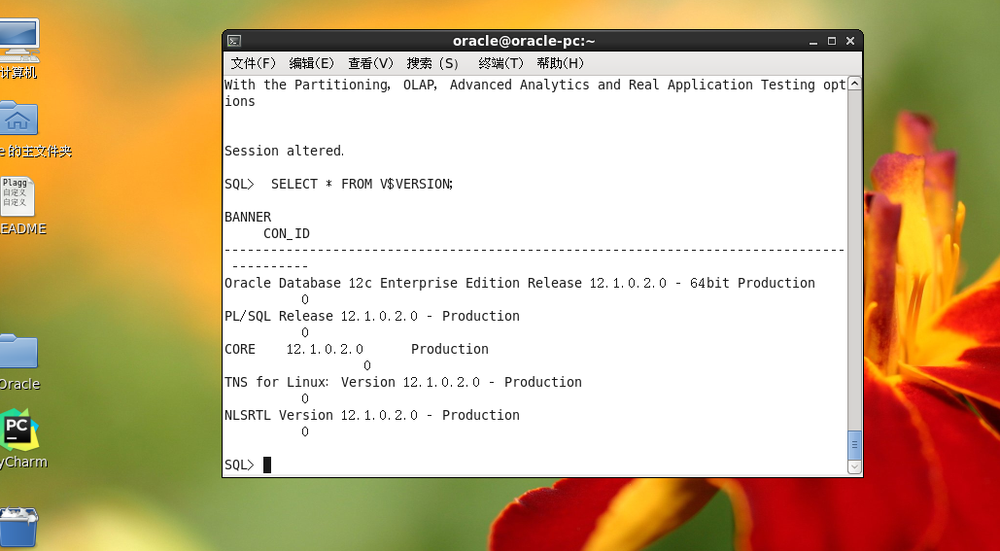图 9-1 甜点商城查看OS和ORACLE配置信息

9.2 dataguard主库参数配置

9.2.1检查主库状态，pdb是否为open

<table>
<tbody>
<tr>
<td width="568">

[oracle@oracle-pc ~]$ sqlplus / as sysdba

SQL*Plus: Release 12.1.0.2.0 Production on 星期日 11月 24 17:08:52 2019

Copyright (c) 1982, 2014, Oracle. &nbsp;All rights reserved.

Connected to:

Oracle Database 12c Enterprise Edition Release 12.1.0.2.0 - 64bit Production

With the Partitioning, OLAP, Advanced Analytics and Real Application Testing options

Session altered.

SQL&gt; show pdbs

&nbsp;&nbsp;&nbsp;&nbsp;CON_ID CON_NAME &nbsp;&nbsp;&nbsp;&nbsp;&nbsp;&nbsp;&nbsp;&nbsp;&nbsp;&nbsp;&nbsp;&nbsp;&nbsp;&nbsp;&nbsp;&nbsp;&nbsp;&nbsp;&nbsp;&nbsp;&nbsp;&nbsp;OPEN MODE &nbsp;RESTRICTED

---------- ------------------------------ ---------- ----------

&nbsp;&nbsp;&nbsp;&nbsp;&nbsp;&nbsp;&nbsp;&nbsp;&nbsp;2 PDB$SEED &nbsp;&nbsp;&nbsp;&nbsp;&nbsp;&nbsp;&nbsp;&nbsp;&nbsp;&nbsp;&nbsp;&nbsp;&nbsp;&nbsp;&nbsp;&nbsp;&nbsp;&nbsp;&nbsp;&nbsp;&nbsp;&nbsp;READ ONLY &nbsp;NO

&nbsp;&nbsp;&nbsp;&nbsp;&nbsp;&nbsp;&nbsp;&nbsp;&nbsp;3 PDBORCL &nbsp;&nbsp;&nbsp;&nbsp;&nbsp;&nbsp;&nbsp;&nbsp;&nbsp;&nbsp;&nbsp;&nbsp;&nbsp;&nbsp;&nbsp;&nbsp;&nbsp;&nbsp;&nbsp;&nbsp;&nbsp;&nbsp;&nbsp;READ WRITE NO

&nbsp;&nbsp;&nbsp;&nbsp;&nbsp;&nbsp;&nbsp;&nbsp;&nbsp;4 LOCALHOST_PDBORCL_TEST &nbsp;&nbsp;&nbsp;&nbsp;&nbsp;&nbsp;&nbsp;&nbsp;READ WRITE NO

SQL&gt;

</td>
</tr>
</tbody>
</table>

&nbsp;

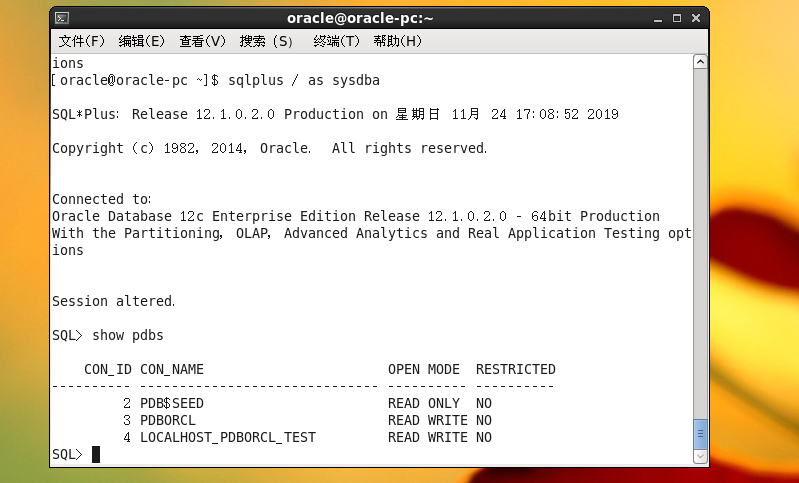图 9-2 甜点商城查看检查主库状态

9.2.2检查主库是否开启force_logging，否则要执行以下命令

<table>
<tbody>
<tr>
<td width="568">

SQL&gt; select force_logging from v$database;

SQL&gt; &nbsp;alter database force logging;

Database altered.

SQL&gt; select force_logging from v$database;

FORCE_LOGGING

---------------------------------------

YES

SQL&gt;

</td>
</tr>
</tbody>
</table>

&nbsp;

&nbsp;

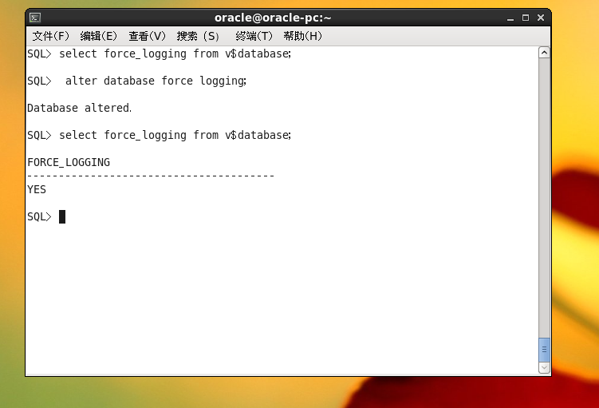图 9-3 甜点商城查看检查主库是否开启force_logging

9.2.3检查主库归档模式开启情况

<table>
<tbody>
<tr>
<td width="568">

SQL&gt; archive log list;

Database log mode &nbsp;&nbsp;&nbsp;&nbsp;&nbsp;&nbsp;&nbsp;&nbsp;&nbsp;&nbsp;&nbsp;&nbsp;&nbsp;Archive Mode

Automatic archival &nbsp;&nbsp;&nbsp;&nbsp;&nbsp;&nbsp;&nbsp;&nbsp;&nbsp;&nbsp;&nbsp;&nbsp;Enabled

Archive destination &nbsp;&nbsp;&nbsp;&nbsp;&nbsp;&nbsp;&nbsp;&nbsp;&nbsp;&nbsp;&nbsp;USE_DB_RECOVERY_FILE_DEST

Oldest online log sequence &nbsp;&nbsp;&nbsp;&nbsp;1618

Next log sequence to archive &nbsp;&nbsp;1620

Current log sequence &nbsp;&nbsp;&nbsp;&nbsp;&nbsp;&nbsp;&nbsp;&nbsp;&nbsp;&nbsp;1620

SQL&gt;

</td>
</tr>
</tbody>
</table>

&nbsp;

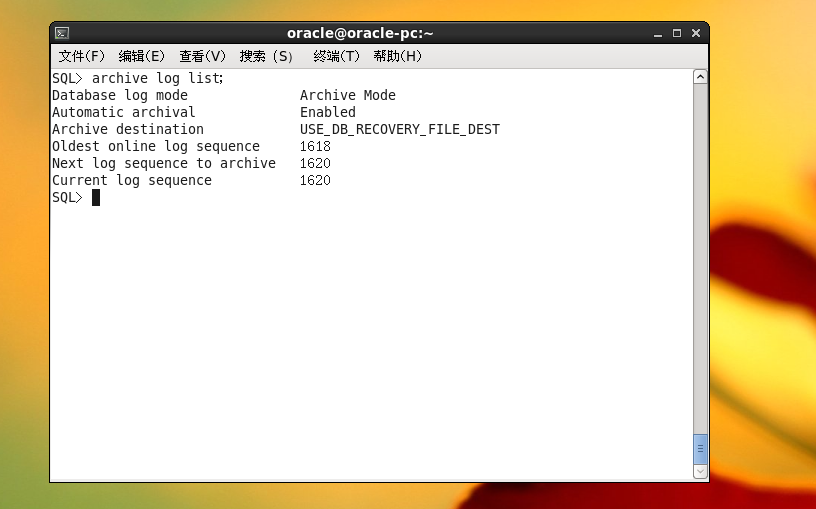图 9-4 甜点商城查看检查主库检查主库归档模式开启情况

&nbsp;

&nbsp;

9.2.4检查在线日志redolog，确认member和group#，根据在线日志添加standby logfile（以下操作均在CBD下操作）

<table>
<tbody>
<tr>
<td width="568">

SQL&gt; select group#, members, bytes from v$log;

&nbsp;

&nbsp;&nbsp;&nbsp;&nbsp;GROUP# &nbsp;&nbsp;&nbsp;MEMBERS &nbsp;&nbsp;&nbsp;&nbsp;&nbsp;BYTES

---------- ---------- ----------

&nbsp;&nbsp;&nbsp;&nbsp;&nbsp;&nbsp;&nbsp;&nbsp;&nbsp;1 &nbsp;&nbsp;&nbsp;&nbsp;&nbsp;&nbsp;&nbsp;&nbsp;&nbsp;2 &nbsp;&nbsp;52428800

&nbsp;&nbsp;&nbsp;&nbsp;&nbsp;&nbsp;&nbsp;&nbsp;&nbsp;2 &nbsp;&nbsp;&nbsp;&nbsp;&nbsp;&nbsp;&nbsp;&nbsp;&nbsp;1 &nbsp;&nbsp;52428800

&nbsp;&nbsp;&nbsp;&nbsp;&nbsp;&nbsp;&nbsp;&nbsp;&nbsp;3 &nbsp;&nbsp;&nbsp;&nbsp;&nbsp;&nbsp;&nbsp;&nbsp;&nbsp;1 &nbsp;&nbsp;52428800

&nbsp;

SQL&gt;

</td>
</tr>
</tbody>
</table>

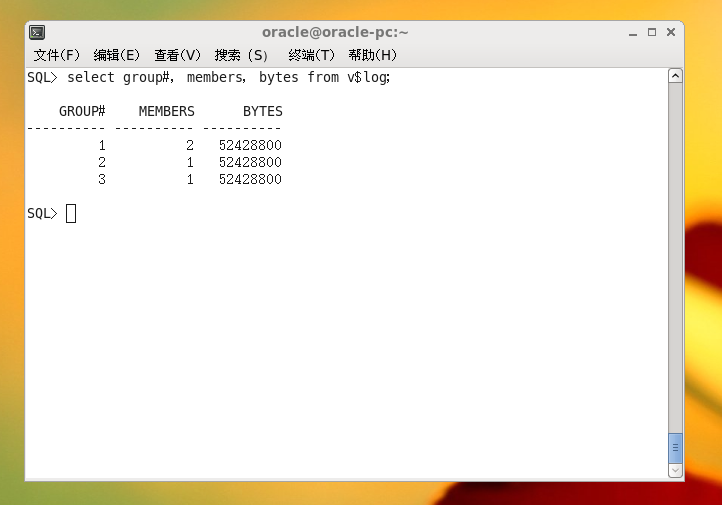图 9-5 甜点商城检查在线日志redolog

添加standby logfile（3+1）：

<table>
<tbody>
<tr>
<td width="568">

ALTER DATABASE ADD STANDBY LOGFILE '/home/app/oracle/oradata/orcl/onlinelog/stdredo01.log' size 50M;

ALTER DATABASE ADD STANDBY LOGFILE '/home/app/oracle/oradata/orcl/onlinelog/stdredo02.log' size 50M;

ALTER DATABASE ADD STANDBY LOGFILE '/home/app/oracle/oradata/orcl/onlinelog/stdredo03.log' size 50M;

ALTER DATABASE ADD STANDBY LOGFILE '/home/app/oracle/oradata/orcl/onlinelog/stdredo04.log' size 50M;

&nbsp;

</td>
</tr>
</tbody>
</table>

&nbsp;

9.3.配置两个数据库的网络参数文件tnsname.ora和listener.ora

primary和Standby上的tnsnames.ora相同。

9.3.1配置tnsnames.ora参数文件

<table>
<tbody>
<tr>
<td width="568">

#primary database

porcl =

(DESCRIPTION =

(ADDRESS_LIST =

(ADDRESS = (PROTOCOL = TCP)(HOST = oracle-one)(PORT = 1521))

(ADDRESS = (PROTOCOL = TCP)(HOST = 10.11.12.1)(PORT = 1521))

)

(CONNECT_DATA =

(SERVICE_NAME = orcl)

)

)

#standby database

sorcl=

(DESCRIPTION =

(ADDRESS = (PROTOCOL = TCP)(HOST = 10.11.12.2)(PORT = 1521))

(CONNECT_DATA =

(SERVER = DEDICATED)

(SERVICE_NAME = orcl)

(UR=A)

)

)

#pluggable database

cdb =

(DESCRIPTION =

(ADDRESS_LIST =

(ADDRESS = (PROTOCOL = TCP)(HOST = oracle-one)(PORT = 1521))

(ADDRESS = (PROTOCOL = TCP)(HOST = 10.11.12.1)(PORT = 1521))

)

(CONNECT_DATA =

(SERVICE_NAME = cdb)

)

)

</td>
</tr>
</tbody>
</table>

9.3.2配置监听文件

<table>
<tbody>
<tr>
<td width="568">

# listener.ora Network Configuration File: /home/app/oracle/product/12.2.0/dbhome_1/network/admin/listener.ora

# Generated by Oracle configuration tools.

SID_LIST_LISTENER =

(SID_LIST =

(SID_DESC =

(GLOBAL_DBNAME = orcl)

(ORACLE_HOME = /home/app/oracle/product/12.2.0/dbhome_1)

(SID_NAME = ORCL)

)

)

LISTENER =

(DESCRIPTION_LIST =

(DESCRIPTION =

(ADDRESS = (PROTOCOL = TCP)(HOST = oracle-one)(PORT = 1521))

)

(DESCRIPTION =

(ADDRESS = (PROTOCOL = IPC)(KEY = EXTPROC1521))

)

)

ADR_BASE_LISTENER = /u01/app/oracle

LISTENERD =

(DESCRIPTION_LIST =

(DESCRIPTION =

(ADDRESS = (PROTOCOL = TCP)(HOST = oracle-one)(PORT = 1521))

)

)

</td>
</tr>
</tbody>
</table>

9.4.配置数据库参数文件

注意：数据库参数文件的调整时注意PDB和CDB的切换运行，否则会报如下错误

9.4.1主库配置完后参数文件：如下（如果是从pfile指定文件启动，启动完成后要创建spfile文件）

<table>
<tbody>
<tr>
<td width="568">

orcl.__data_transfer_cache_size=0

orcl.__db_cache_size=234881024

orcl.__inmemory_ext_roarea=0

orcl.__inmemory_ext_rwarea=0

orcl.__java_pool_size=4194304

orcl.__large_pool_size=8388608

orcl.__oracle_base='/home/app/oracle'#ORACLE_BASE set from environment

orcl.__pga_aggregate_target=272629760

orcl.__sga_target=507510784

orcl.__shared_io_pool_size=20971520

orcl.__shared_pool_size=222298112

orcl.__streams_pool_size=0

*.audit_file_dest='/u01/app/oracle/admin/orcl/adump'

*.audit_trail='db'

*.compatible='12.2.0'

*.control_files='/home/app/oracle/oradata/ORCL/controlfile/o1_mf_dqflr6xp_.ctl','/home/app/oracle/fast_recovery_area/orcl/ORCL/controlfile/o1_mf_dqflr78t_.ctl'

*.db_block_size=8192

*.db_create_file_dest='/home/app/oracle/oradata'

*.db_file_name_convert='/home/app/oracle/oradata/ORCL/datafile/','/u01/app/oracle/oradata/ORCL/datafile/'

*.db_name='orcl'

*.db_recovery_file_dest='/home/app/oracle/fast_recovery_area/orcl'

*.db_recovery_file_dest_size=8016m

*.db_unique_name='porcl'

*.diagnostic_dest='/home/app/oracle'

*.dispatchers='(PROTOCOL=TCP) (SERVICE=orclXDB)'

*.enable_pluggable_database=true

*.fal_client='PORCL'

*.fal_server='SORCL'

*.log_archive_config='DG_CONFIG=(porcl,sorcl)'

*.log_archive_dest_1='location=/home/app/oracle/oradata/arch db_unique_name=porcl'

*.log_archive_dest_2='service=sorcl LGWR ASYNC noaffirm reopen=60 valid_for=(online_logfiles,primary_role) db_unique_name=sorcl'

*.log_archive_dest_state_2='enable'

*.log_file_name_convert='/home/app/oracle/oradata/ORCL/onlinelog/','/home/app/oracle/oradata/ORCL/onlinelog/','/home/app/oracle/fast_recovery_area/orcl/ORCL/onlinelog/','

/home/app/oracle/fast_recovery_area/orcl/ORCL/onlinelog/'

*.memory_target=744m

*.open_cursors=300

*.processes=300

*.remote_login_passwordfile='EXCLUSIVE'

*.service_names='ORCL'

*.standby_file_management='auto'

*.undo_tablespace='UNDOTBS1'

</td>
</tr>
</tbody>
</table>

9.4.2将主库修改后的参数文件传送到备库

9.4.3修改从库数据库参数文件并使用该参数文件从pfile启动

<table>
<tbody>
<tr>
<td width="568">

*.db_unique_name=

*.log_archive_config=

*.log_file_name_convert=

*.db_file_name_convert=

*.log_archive_dest_1=

*.log_archive_dest_2=

*.standby_file_management=

*.fal_server=

*.fal_client=

</td>
</tr>
</tbody>
</table>

9.4.4主库密码文件传送到备库

<table>
<tbody>
<tr>
<td width="568">

[oracle@oracle-pc ~]$ scp orapworcl orcle-one:/dbs/

</td>
</tr>
</tbody>
</table>

9.5.启动standby database到nomount状态

9.5.1检查tns连接名是否正常(主备库均需要检查)

<table>
<tbody>
<tr>
<td width="568">

tnsping porcl

tnsping sorcl

lsnrctl

</td>
</tr>
</tbody>
</table>

9.5.2启动备库

<table>
<tbody>
<tr>
<td width="568">

startup pfile='/home/oracle/standbypfile.ora' nomount

</td>
</tr>
</tbody>
</table>

启动后创建spfile

<table>
<tbody>
<tr>
<td width="568">

create spfile from pfile='/home/oracle/standbypfile.ora'

</td>
</tr>
</tbody>
</table>

参考文献

[1]Oracle 12c 数据库基础教程[M]. 赵卫东、刘永红，于曦.北京：科学出版社，2017.

[2]oracle 12C dataguard搭建. <a href="https://blog.csdn.net/s754520480/article/details/79789771"><u>https://blog.csdn.net/s754520480/article/details/79789771</u></a>

[3]Oracle 数据库应用. &nbsp;<a href="https://github.com/zwdcdu/oracle"><u>https://github.com/zwdcdu/oracle</u></a>

